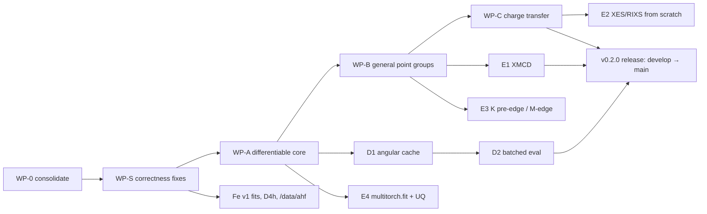

# multitorch development plan — fully differentiable port + beyond Oh/D4h

**Date:** 2026-09-09
**Branch:** `develop` (created from `d4h-transi-normalization`, HEAD `7b0c1fa`; merges to `main` when everything is done)
**Test baseline:** 539 passed / 2 skipped / 3 xfailed
**Compute:** exxa (`~/code/multitorch`, 2× RTX 4090, 128 cores, 503 GB RAM). Large outputs go to `/data/ahf/multitorch/`.

---

## 0. Where we left off (May 2026) and where we are now

### Branch state on 2026-09-09

| Branch | HEAD | Status |
|---|---|---|
| `main` | `c061f86` | v0.1.0 + Phase 1c scaffolding. Behind by 14 commits. |
| `d4h-dispatcher-v2` | `382b04d` | V2 per-D4h-irrep dispatcher. Closed BUG-001 (DS gap) and BUG #2 (label collision). Unmerged. |
| `d4h-transi-normalization` | `7b0c1fa` | Wigner-Eckart prefactor + partner-summed RME; all 13 TRANSI blocks match `nid8ct` at 1e-6. Unmerged. |
| **`develop`** | `7b0c1fa` | **New.** Contains both feature branches. All new work lands here. |

Open GitHub issues: #1 (Phase 1c dispatcher, closable), #2 (TRANSI normalization; only the "re-run the five Fe v0 fits" bullet remains).

### The two computation paths and what each can do today

| Capability | Phase 5 path `calcXAS(element, valence, sym, edge, cf, …)` | From-scratch path `calcXAS_from_scratch` / `generate_ledge_rac` |
|---|---|---|
| Angular structure | Loaded from bundled Fortran fixtures (`data/fixtures/`) | Generated in Python (CFP tables + Wigner + O(3)→Oh→D4h projection) |
| Symmetries | Whatever fixtures exist: Oh for Ti–Ni (8 ions), D4h for Ni only | `oh`, `d4h` |
| Half-integer J (odd-electron ions: Fe(III) d5, Co(II) d7, Cr(III) d3, V(IV) d1, Cu(II) d9) | Yes via fixtures (Oh only) | Oh yes; **D4h raises NotImplementedError** (no double-group tables) |
| Charge transfer | Yes (nid8ct fixture) | **No** (single configuration only) |
| Autograd | **Yes** in slater, soc, tendq, dt, ds, delta (verified today) | **Partial.** `tendq`/`dt`/`ds` carry gradients (autograd matches finite difference to 1e-8). `slater`/`soc` fail at `rac_generator.py:160` (`H += fk_ev * shell_mat`, numpy accumulator) and five sibling sites. No test protects the working CF gradient. |
| Accuracy vs Fortran | Parity at 1e-6 to 1e-12 **only at slater=soc=1 with the fixture's own CF/CT parameters.** At the default `slater=0.8` the forward model is wrong (audit S1: only the ground config-1 block is rescaled, F⁰ and the E_av constant are scaled, the 2p⁵3dⁿ⁺¹ manifold is not). Fixture-path `dt` omits the `−35·Dt/6` cross term (S2). | The quoted "0.978 cosine" is computed after an 830 eV peak shift on a window holding 66% of the intensity (audit §7.1). Root causes: HFS runs with no closed core (S3: F²dd 2.7×, G¹pd 6.8× rcn31), D4h CF blocks not one-electron-consistent + Ds sign flipped (S4), Oh dipole strengths off by triad-dependent 1.5–7× (S5). |
| Speed (single spectrum) | 20 ms (Ni) – 2 s (V d2) cached | 6–10 s; **95% is regenerating uncached angular constants** (`_complex_subduction_matrix` ×704, `wigner_D_matrix` ×16,896, `_small_d` ×1.77M per call). Four `lru_cache` decorators measured 12× (Fe d6 Oh 6.1 s → 0.5 s; Fe d6 D4h 10 s → 0.7 s). |

So the answer to "where did we end up on going beyond Oh and D4h" is: **nowhere yet, and D4h itself is only complete for even-electron ions.** The `fits/` Fe work still runs in the Oh approximation for exactly that reason (Fe(III) d5 is half-integer J). The 714 eV residual in every v0 fit is the symptom.

### What the Fortran suite could do that we cannot yet

`ttrac` reads Butler's branching library (`ttmult/inputs/disk0`), which tabulates the point groups **O, T, K, C1–C6, D2–D6, D∞** (inversion handled by parity labels, so Oh = O×Ci, D4h = D4×Ci, Td ≅ O with relabeling). pyctm only ever wrote chains for `oh`, `d4h`, `c4h`. CTM4XAS users expect at least Oh, Td, D4h, C4v, D3d, D2h, C2v.

### Known residuals carried forward

The 2026-09 scientific audit (§6) superseded the May-era understanding of these. Verified independently on 2026-09-09: halving `slater` on the fixture path shifts all Ni sticks by a rigid +43.4 eV with the span unchanged (24.383 eV both ways); `build_ban.py:118` writes raw `tendq` where pyctm writes `tendq − 35·dt/6`.

1. **S1 (fixture path, default regime).** `slater`/`soc` rescale only the ground config-1 HAMILTONIAN blocks; the excited manifold and the ligand-hole config are constants. F⁰ and the configuration-average constant are scaled too (−88.6 eV / +84.2 eV per unit). The `.rme_rcg` store has no separate G^k blocks, so the excited manifold cannot be rebuilt from fixture data: the fix needs the from-scratch two-shell exchange machinery. **Consequence: the v0 Fe fitted `slater`/`soc` values are not comparable with literature.**
2. **S2 (fixture path, D4h).** `dt` is a pure rank-4 E_θ operator, not Ballhausen Dt. One-line fix plus a test against `pyctm.write_BAN.cf_list`.
3. **S3 (from-scratch).** `tables.py:78-80` returns `'2P06 3D08'` with no closed core. Restoring it fixes F^k_dd and ζ2p to ≤1.4%; G^k_pd/F²_pd stay 2.5–2.8× and ζ3d(Blume-Watson) 1.39× → two further defects in `slater.py` / `blume_watson.py`. F²_pd omission is ~4 eV of span, not "a few tenths".
4. **S4 (from-scratch D4h).** Eg/A2g/B2g CF blocks give non-one-electron energies at dt=ds=0 (weighted means of true levels → ADD-entry/matrix-index defect in `_make_d4h_op_adds` for multi-`(J, oh_irrep, copy)` irreps); Ds sign opposite to fixture/Ballhausen. TRANSI blocks are exactly right (issue #2 closure holds).
5. **S5 (from-scratch Oh).** Dipole Frobenius² per triad off by 1.46–7.0× vs Fortran; changes normalized spectra. The D4h dispatcher's `_make_d4h_dipole_adds` is on the Fortran convention and should serve Oh.
6. **S6 (API).** All "Oh" fixtures are 2-configuration LMCT calculations applied silently (Fe: cosine 0.36 vs ionic); `delta=float` sets Δ_gs only; `delta`/`lmct` docstrings wrong; `u` ignored.
7. Must-document items (audit §8): `T` dead at `max_gs=1`; `med_energy` dead and the midpoint split gives early-3d L3 lines the L2 width; Boltzmann weights unnormalized and degenerate ground components split by rounding; legacy pseudo-Voigt η under by ~0.11 (SCA-001); `xv != 0.0` guard severs autograd at exactly-zero CF parameters; d⁰ silently ignores `slater`/`soc`; HFS `converged` flag never checked.
8. `safe_eigh` degeneracy perturbation: Cr d3 excluded from autograd tests because eigh backward gives NaN at exact degeneracies.
10. **S7 (found 2026-09-09 with a Fortran oracle; from-scratch, both paths' foundations).** `_build_hamiltonian_cowan_matrices` multiplied F^k into the rank-k *unit-tensor* SHELL blocks (crystal-field operators) and used the spin operator S as the spin-orbit operator; the excited-manifold two-shell exchange/SOC builders have the same class of error (non-uniform factors vs Fortran). eV-scale. No test covered the HAMILTONIAN operator (the 1e-6 parity test excludes it by design). Ground manifold **fixed**: `compute_coulomb_blocks` (f_k = ½⟨l‖C^k‖l⟩²[U^k·U^k − n/(2l+1)] relative to the configuration average) and `compute_soc_blocks` (V^(11) double tensor), both ×√(2J+1) (COWAN-store RME convention), match ttrcg to 3e-6 (`tests/test_angular/test_hamiltonian_operators.py`, oracle `tests/reference_data/fortran_ops/`). Excited manifold: WP-S S1b.
11. **S8 (fixed 2026-09-09).** `atomic/slater.py` divided the Y^k potential by r a second time and omitted the Hartree→Rydberg factor: F^0(1s,1s) was 0.60× the exact hydrogenic value and F^k(a,b) ≠ F^k(b,a) (p–d integrals 2.5× off). Now exact to 2e-4 on the default mesh for F^0, F^2, G^0, G^1 hydrogenic references.
12. **Bundled fixtures are Fortran runs at 80% Slater reduction** (all 8 Oh fixtures verified against regenerated pyctm runs, max |Δ| ≤ 2e-5), and their `.rcn31_out` files describe the d^(n+1) ligand-hole configuration. Therefore the fixture path's `slater=1.0` already means 80%, and its raw F^k came from the wrong configuration. Cowan's tabulated F^k come from RCN31's second pass with EXF=0.65 and his HX exchange; with EXF=0.65 the HFS port is within 1.5% (F^k dd), 6–9% (p–d), 28% (ζ3d) of Cowan. The from-scratch pipeline now uses EXF=0.65; the HX terms (`rcn31.f` KUT=−1, CA0/CA1) are WP-S S3b.
9. The five Fe v0 fits were never re-run with the V2 dispatcher, and must not be re-run until S1 is fixed. **(Re-run 2026-09-13 with S1a; see status table. v0 and v1 both ran with the fixture LMCT defaults; 200 Adam steps is unconverged; at 1000 steps some broadening widths hit their bounds, i.e. the Oh model absorbs D4h structure into lineshape.)**
13. **S1a/S1b fixture path (fixed 2026-09-13).** `build_cowan.py` now decomposes *every* HAMILTONIAN block of a store (all sections; ground d^n, ligand-hole d^(n+1)L̲, core-hole 2p⁵d^(n+1) and 2p⁵d^(n+2)L̲) as E_av·√(2J+1)·I + Σ F^k O + Σ G^k O + Σ ζ O by a joint least-squares fit over all J of a configuration, asserts elementwise residual ≤ 1e-5·max(1,|H|) (observed ≤ 7.5e-6 on all 78 configurations of the 12 bundled stores; the floor is Fortran's 6-decimal print on diagonals up to ~100 eV), and rebuilds as H_fixture + (slater/r_S − 1)·S + (soc/r_ζ − 1)·Z. `slater`/`soc` are therefore **absolute** (fraction of HF); r_S = 0.8 for every bundled store except `nid8ct_ems` (1.0), r_ζ = 1. No `.rcn31_out` is read. Findings that made it work:
    - **Fortran term phase.** Cowan's basis differs from our CFP-derived basis by σ(αSL) = (−1)^(L+S−S_min) per shell (product over shells). Invisible for d²/d⁸ (all terms have even L+S) and to Coulomb; our SHELL/SOC/MULTIPOLE builders are mutually consistent, so from-scratch spectra are unaffected. Oracle: our SHELL blocks × σ equal the stores' SHELL2 blocks to 5e-6 for d², d³, d⁵, d⁶, d⁷ (`tests/test_angular/test_cowan_operators.py`).
    - **Three open shells.** pyctm's excited ligand-hole configuration 2p⁵3d^(n+2)L̲⁹ has three open shells for 6 of 8 Oh ions. The ligand shell carries no parameters (no ζ_L, no F/G with L; the ttrcg deck omits them), so the two-shell operators are lifted with L̲ as a spectator in the ((p d) S₁₂L₁₂, L̲) S L J basis (state order: stable sort by (−S, −L)). `angular/cowan_operators.py`.
    - **Shell order** comes from the store's `%P06  D08  D10` lines (GROUND then EXCITE per section); `nid8ct` is valence-first in sections 0 and 3, `nid8`/`als1ni2` are core-first despite being ttmult examples.
    - **ttmult examples** print unreduced HF values in their headers but ttrcg applies 80% internally (fitted F² = 9.7872 = 0.8000 × 12.2341); `nid8ct`'s G³ is at 64%, so only the relative rescale is uniform there. `nid8ct_ems` (RIXS emission) is at 100% while its absorption partner `nid8ct` is at 80%. `calcRIXS` still takes the emission side from the Fortran `nid8ct_ems.ban_out` (not rebuilt), so its absorption and emission Slater reductions differ (0.8 vs 1.0) unless the emission side is moved onto the rebuilt `_ems` store (open).
    - **Transition sections 0/1** of 4-section stores carry parameter-free HAMILTONIAN blocks (the deck has no `state` lines for them); only sections 2/3 feed the assembler.
    - **Oracles** (`tests/test_hamiltonian/test_build_cowan.py`, data in `fortran_ops/oh8_rcg/` and `oh8_s1.0_hamiltonian.npz`, built by `tests/tools/build_oh8_oracle.py` from `/data/ahf/multitorch/fixtures/oracle_oh8`): every fitted coefficient equals the ttrcg input parameter it multiplies (≤ 1.3e-5 eV, all 8 Oh ions, sections 2/3); the 0.8 store + Σ(p₁.₀ − p_fit)·O reproduces the Fortran 100% eigenvalues to ≤ 9.8e-6 eV. **The requested "slater=1.0 to 1e-6 eigenvalues" is not attainable through `slater` alone:** pyctm rounds every RCG input to 3 decimals, so round(0.8F)/0.8 vs round(F) differs by up to 5e-4 eV per parameter and the public `slater=1.0` rebuild agrees with the Fortran 100% run to ≤ 4.7e-4 eV (tested against the per-block Weyl bound of that rounding).
    - Consequence for users: the fixture-path default `slater=0.8` is unchanged in value but now means 80% of HF everywhere; code that passed `slater=1.0` to mean "the fixture as-is" must pass 0.8. `calcDOC` and `calcRIXS` (fixture mode) defaults moved from 1.0 to 0.8 for the same reason.
14. **Cr³⁺ fixture path vs Fortran `.ban_out` (open, found 2026-09-13 by the S7 union-window metric).** Phase 5 at the fixture's own reductions agrees with the bootstrap `.ban_out` to cosine ≥ 0.99999997 for Ti⁴⁺, V³⁺, Mn²⁺, Fe²⁺, Fe³⁺, Co²⁺, Ni²⁺ and nid8ct, but Cr³⁺ is at 0.9889 (max|Δ| 0.19 of the peak, area 1.002), independent of T and max_gs and with no ground-state degeneracy (S1+ gap 2 eV). The old test excused it as "degeneracy rounding" at a 0.98 threshold. Observations: the two PRMULT copies of the S1+→S1− triad are assembled from copy 0 (`read_ban` drops the copy index, `_find_transi_block` returns the first match), and phase 5 builds 7770 S1− final states where ttban printed 2730; both also hold for Mn/Fe³⁺/Co (3810 vs 1410), which match, so neither alone explains Cr. Next step: per-triad stick comparison for Cr against the `.ban_out`.
15. **max_gs=1 and near-degenerate ground levels (open).** `get_sticks*` counts levels with exact float equality. Symmetry-degenerate ground components in different blocks differ by ~1e-15 eV (from scratch) or ~1e-6 eV (fixture stores, 6-decimal RMEs), while real splittings can be smaller (Mn²⁺ ⁶A₁g cubic zero-field splitting 2.8e-7 eV, which pyctm resolves). Consequence: a D4h spectrum in the Oh limit at max_gs=1 keeps 2/3 of the degenerate ground level. No fixed tolerance separates noise from physics; needs a physical definition (e.g. a kT-based window). Tests that compare across symmetry use max_gs=40 with T = 80 K.
16. **Findings behind S6/S7 (2026-09-13).** (a) `med_energy` was ignored everywhere (the L3/L2 width switch always used the stick-range midpoint): honoring pyctm's value (25) takes the Ti⁴⁺ comparison with the pyctm `.xy` from cosine 0.978 to 0.99996 and every ion to ≥ 0.99992 on pyctm's grid; the Ti "known limitation" in the README/tests was this bug. (b) `delta=float` left EF2 at the template, `u` was dropped, and `mlct` overwrote V(t2g); now EG2 = Δ, EF2 = Δ − u (pyctm), `u` wired, `lmct` accepts channel names, `mlct` raises. (c) Zero-intensity sticks (e.g. the V = 0 ligand-hole manifold 100 eV up) set the auto window. (d) A crystal-field or hopping tensor exactly at 0 had no gradient. (e) The D4h from-scratch vs Fortran nid8ct gap (union cosine 0.969) is entirely the HFS atomic parameters (S3b): with nid8ct's own fitted parameters the generator reproduces the store at 0.99999992.
17. **From-scratch excited manifold gauge (fixed 2026-09-13).** The 2026-09-10 claim "from-scratch reproduces Fortran for even-electron ions" had been verified for Ni d⁸ only. With each fixture's own parameters (from the S1a decomposition) V³⁺ d² was at cosine 0.853 and Fe²⁺ d⁶ at 0.991. Block-by-block against the Fortran store: ground HAMILTONIAN/CF and excited HAMILTONIAN match under the term gauge σ = (−1)^(L+S−S_min), but the excited CF (`compute_two_shell_shell_blocks`) and MULTIPOLE blocks match only with an extra σ on the excited valence term, i.e. those two builders already work in Cowan's term phase while `compute_two_shell_operators` does not. The excited manifold was therefore internally inconsistent whenever the excited d shell is multi-term (every ion but Ni²⁺, whose 3d⁹ is single-term). Fix: `_build_excited_hamiltonian_cowan` applies σ of the valence term. V, Fe²⁺ and Ni now agree with Fortran in stick energies (≤ 2.4e-6 eV), absolute intensities (≤ 1e-5) and spectrum (cosine > 0.99999), Oh and D4h (`tests/test_integration/test_from_scratch_fortran_parity.py`, red without the fix). Half-integer ions with the same parameters: Cr³⁺ 0.73, Mn²⁺ 0.91, Fe³⁺ 0.88, Co²⁺ 0.75 cosine with total intensity 2.2–3.3× Fortran (legacy Oh coefficients, WP-B).
18. **Unnormalised Boltzmann weights put a kink in the spectrum at every ground-level crossing (found 2026-09-13 during A5; kept by decision D-1, see "Deferred decisions" below).** `get_sticks*` weights by `exp((E_min − E_g)/kT)` without dividing by the partition function, exactly as pyctm (`pyctm/get_spectrum.py:84`). The total weight Z·exp(E_min/kT) is then non-differentiable wherever the lowest ground branch switches, e.g. the D4h Oh limit dt = 0: from scratch, Ni²⁺ at T = 80 K, max_gs = 40, the weighted loss has one-sided slopes +2.41 / −5.55 (normalised to L) and its area peaks at dt = 0. Autograd returns one side, central FD their mean (−1.57); neither is "the" derivative. Dividing by the pool partition function makes both slopes −1.574. **Consequence:** the planned A5 oracle (FD at dt = ds = 0 and at soc = 0) cannot pass on the current forward model; with max_gs = 1 the same points are also discontinuous (residual 15, FD ≈ ±5000). Normalising changes absolute intensities by 1/Z (a global factor per spectrum, spectral shape unchanged) and departs from pyctm: **decided 2026-09-13 to keep pyctm's convention for now (D-1).** Away from exact crossings (dt = ds = 1e-3, soc = 1e-3, Cr³⁺ Oh fixture) autograd already matches FD to ≤ 3.5e-6 with the current `safe_eigh`.
19. **The A5 design as written would be wrong at exact degeneracy (found 2026-09-13).** For a loss tr(f(H)A) (Boltzmann-weighted intensities are of this form) the exact gradient has Daleckii–Krein divided differences (f(λ_i) − f(λ_j))/(λ_i − λ_j) → f′(λ) on degenerate pairs. `eigh` backward only sees (Uᵀ∂U)_ij, whose antisymmetric part carries f(λ_i) − f(λ_j) = 0 at exact degeneracy, so a Lorentzian-regularised 1/(λ_i − λ_j) drops the f′·A_ij term (basis-dependent result whenever A is not ∝ I on the degenerate space, e.g. accidental degeneracies of copies inside one irrep block, or ζ = 0). The existing 1e-12·linspace diagonal perturbation splits the pair by δ and so recovers f′ to O(δ) — it is closer to right than the Lorentzian. Its real defect is that it shifts the *forward* eigenvalues only when `requires_grad`, so grad and no-grad evaluations can count ground levels differently under residual 15. Recommended A5 instead: exact forward (no shift) + backward that perturbs only inside the backward, or wait for residual 18/15 decisions.
20. **From-scratch parameter vocabulary after A1/A2 (2026-09-13).** Operators are keyed by shell index (`F2_11`, `F2_12`, `G1_12`, `zeta_2`) with unambiguous shell-letter aliases (`F2dd`, `F2pd`, `G1pd`, `zeta_p`) for `atomic` overrides; the Rydberg dicts (`'F2'`, `'F2_dd'`, `'G1_pd'`, `{'p','d'}`) survive only as the input format of `generate_ledge_rac` / `_hfs_to_slater_params` (`ledge_reference_ev` converts). A3 is reduced to retiring those dicts and `ConfigParams`/`ScaledConfigParams`. HFS is ~0.7 s of the 0.8 s from-scratch call and is now cached per ion. The unknown-cf-key check exposed `test_d4h_collapses_to_oh_when_dt_ds_zero` passing `{'10dq': 1.0}` (silently ignored since written; the default is also 1.0).

21. **From-scratch D4h depended on the machine's LAPACK (fixed 2026-09-14).** `_oh_irrep_matrices_real_std` took the Oh E-irrep partner basis from `np.linalg.eigh` of a projector whose eigenvalue-1 space is two-dimensional. Every rotation there is a valid Oh basis, but the partner-resolved Oh→D4h subduction needs partner 0 ∝ d(x²−y²) and partner 1 ∝ d(z²) *with equal signs*; macOS Accelerate happened to return an admissible basis, exxa's LAPACK did not. On exxa the same commit gave Ni d⁸ D4h ground levels 0.27–0.64 eV off the Fortran nid8ct store at Dt, Ds ≠ 0 (Oh limit correct everywhere), so **the three v2 D4h fits run on exxa are invalid**. Every D4h test sat at the Oh limit or had no multiplets. Fix: the E basis is pinned to (d(x²−y²), d(z²)). Oracles: Ni D4h from scratch vs the Fortran store at two (10Dq, Dt, Ds) points (≤ 2e-5 eV), and the same with eigenvectors randomly rotated inside every degenerate subspace in a fresh process (`tests/tools/lapack_scramble.py`; seed 2 reproduced exxa's wrong levels exactly before the fix). Fe²⁺/V³⁺ Oh and D4h spectra are invariant to the scrambling to ≤ 2e-12. **Hidden sign convention fixed 2026-09-15.** The D4h Dt operator is the Butler-weighted sum of two routes (Oh A1 and Oh E at rank 4), each built from eigen-decompositions with arbitrary sign; the Ballhausen pin fixed only the sign of the sum, so their *relative* sign was LAPACK's choice. Flipping eigenvector signs (which LAPACK builds also do differently, not only rotations in degenerate spaces) broke Dt by up to 1.6 eV. Each route is now pinned to a positive m = 0 real-harmonic component, the convention the Butler coefficients were calibrated to; with it an E-partner sign flip is harmless. The scramble harness now also flips every eigen/singular vector sign and is deterministic per input matrix (a non-deterministic scramble falsely broke uncached, repeated calls). Oracle: Ni D4h vs Fortran at four (10Dq, Dt, Ds) points incl. Ds-only and Dt-only, unscrambled and for two scramble seeds; without the route pin seed 2 fails at 0.66 eV. WP-B's general `PointGroup` must gauge-fix every operator vector the same way. Diagnosis recipe (reusable): scramble one calling function at a time (`install(seed, only=name)`) over several seeds, then check the failing site's outputs: basis vectors (gauge, harmless if shared) vs operator vectors (physical, must be pinned).
22. **Half-integer fixtures assembled phantom configurations (fixed 2026-09-14, commit 5f88e9c).** `_get_config_dims_from_transi` counted each PRMULT copy of a triad's TRANSI block as a configuration, so the Γ8 irreps of Cr³⁺, Mn²⁺, Fe³⁺, Co²⁺ carried duplicated, dark, un-offset ligand-hole blocks (Fe³⁺ final block 3810 states vs ttban's 1410). Spectra were unchanged (recomputed v2 Oh fit losses identical to 1e-12), cost ~20×, and ground-level listings contained phantom levels. Cr³⁺ residual 14 is unchanged by it, and the "Cr d³ 1074-dim Hamiltonian" autograd exclusion in `test_phase5_multi.py` referred to the inflated size (true size 372); both need a fresh look.
23. **Ground-state character is now computed, not inferred (2026-09-14, commit af66e65).** `multitorch.analysis.analyze_ground_state` gives ⟨S²⟩, term and configuration weights of the lowest levels for fixture and from-scratch caches; `fits/analyze_ground_states.py` runs it on fit results. On the v2 Oh fits it shows the FePc and FeTPC-Cl (as Fe(II)) octahedral fits sit on the high-spin/low-spin crossover (a singlet and a quintet within 0.1–9 meV), not in a well-defined spin state.

24. **Charge-transfer store operators: Fortran sign rules (2026-09-15, WP-C C1–C3).** Every ttrcg charge-transfer block is now generated in the Fortran store basis and matched elementwise against all eight two-configuration fixtures (`angular/cowan_operators.py`, `tests/test_angular/test_{ct_operators,shell_tensor_operators}.py`). The rules, none of which is a free fit: SHELL (crystal field on the metal) = σ·M·σ with no block phase (rtol 1e-6, ttrcg single precision); ground-manifold hopping = (−1)^n σ_bra·M·σ_metal(−1)^(S+L); final-manifold hopping (core-hole spectator, Edmonds 7.1.8 on the second member) = −σ·M·σ; dipoles = (−1)^m σ·M·σ·(−1)^(S_c+S_m−S+L_c+L_m−L) (MUPOLE couples metal before core). nid8ct's valence-first 2p⁵3d⁹ maps onto the core-first basis by the coupling swap and the fermionic (−1)^(n_a n_b), an independent check.
25. **nid8ct final-state print precision (2026-09-15).** nid8ct prints its 2p⁵ blocks around E_av = 860 eV, so the exactly degenerate 2p⁵ 3d¹⁰ L̲ levels scatter by ±9e-5 eV in the Fortran store itself (Oh stores, E_av = 20 eV: 1e-6). Charge-transfer parity against nid8ct holds final levels to 2e-4 eV only; ground levels and the Oh fixtures to ≤ 2e-5 eV.
26. **ttrac Butler route phases (2026-09-15, WP-C C4).** The hybridisation actors are route sums with pyctm's strengths; with routes pinned to m = 0 positive, ttrac's rank-2 E route has the opposite phase (the same fact the Ballhausen pin on DS encodes). Analytic oracle: each actor is √5 × its one-electron orbital projector (`test_hybridisation_channels_project_onto_their_orbitals`). The Oh dipole sign triple must be shared by both configurations of a CT calculation (`ranked_triples`).
27. **From-scratch charge transfer is integer J only (2026-09-15).** `generate_ct_ledge_template` raises for odd n (Cr³⁺, Mn²⁺, Fe³⁺, Co²⁺); half-integer J is WP-B2a for the single-configuration path too. Ligand-hole HFS parameters follow pyctm (one more 3d electron), with the ~2 % HX offset of S3b in the absolute values.
### Deferred decisions (revisit)

Choices taken deliberately against a known defect, to be reopened. Each names what was kept, the cost, what would trigger a revisit, and what the change involves.

- **D-1 (2026-09-13): keep pyctm's unnormalised Boltzmann weights.** `get_sticks` / `get_sticks_from_banresult` weight ground state g by `exp((E_min − E_g)/kT)` without dividing by the partition function Z of the pool, as `pyctm/get_spectrum.py:84` does. *Kept because* absolute intensities then match pyctm and the Fortran-chain parity tests unchanged. *Cost:* the spectrum is continuous but not differentiable wherever the lowest ground level changes branch (residual 18: D4h Oh limit dt = ds = 0, ζ = 0, any accidental ground crossing), the total intensity varies with Z (≈ 0.5 % per meV of Dt for Ni²⁺ at 80 K), and a gradient-based fit that lands exactly on such a point gets a one-sided gradient. Gradient tests therefore stay away from exact crossings (`test_autograd_fd*.py` use dt = ds = 1e-3 / ζ = 1e-3 for near-degenerate coverage), and A5 is deferred. *Revisit when* fits need to start at or cross a high-symmetry point, when spectra at different T are compared on an absolute scale, or when A5 is picked up. *Change:* divide `M_weighted` by Σ_pool exp((E_min − E_g)/kT) (each ground state counted once, not once per triad) in both functions, behind a flag with a deprecation cycle; update the Fortran/pyctm parity tests to compare shapes or rescale by Z; verified on 2026-09-13 that this makes the one-sided slopes at dt = 0 equal (−1.574 / −1.574). Pinned by `tests/test_spectrum/test_sticks.py::test_boltzmann_weights_are_unnormalised_pyctm_convention` (fails on purpose if the convention changes).

---

## 1. Goals for this cycle

| ID | Goal | Done when |
|---|---|---|
| **A** | From-scratch path fully differentiable | `torch.autograd.gradcheck`-style finite-difference agreement for every physical parameter (F^k, ζ, R^1, all CF parameters, Δ, U, T) on Ni(II), Fe(II), Fe(III); no fixture files needed |
| **B** | Arbitrary point groups, single and double | Oh, Td, D4h, C4v, D3d, D2h, C2v (at least) for integer *and* half-integer J, validated against Fortran-generated references |
| **C** | Charge transfer from scratch | `nid8ct` reproduced from scratch at ≥ 0.99 cosine; Fe(III)Cl LMCT fits possible |
| **D** | Performance | ≤ 0.1 s per spectrum for Fe d6 D4h after angular cache warm-up; batched sweeps; benchmarks archived in `/data/ahf/multitorch/bench` |
| **E** | Feature extensions | XMCD/XMLD, K pre-edge quadrupole, from-scratch XES/RIXS, uncertainty quantification, a `multitorch.fit` module |
| **S** | Scientific correctness (new, gates everything) | All six "blocks scientific use" audit findings closed with Fortran oracles: a Ni d⁸ fixture regenerated by ttrcg at 80% Slater reduction reproduced at `slater=0.8` to 1e-6 eigenvalues; one-electron CF probe passes on both paths for 10Dq/Dt/Ds; from-scratch HFS integrals within 3% of every bundled `.rcn31_out`; parity metrics on the union window |
| **F** | Codebase health | Architecture deepening applied where it pays; audits (senior review + scientific audit) findings resolved or documented |

---

## 2. Work packages

Effort is in focused working days. Ordering matters: **0 → S → A → B → C**. WP-S comes first because the audit showed the default fixture-path regime and the whole from-scratch path are currently wrong in ways every later package would build on; S1b and A1 share one seam and land together. B replaces the module A makes differentiable; C reuses B's operator machinery. D and E overlap with B/C once A has landed.

### WP-0 — Consolidate (1–2 days)

- [x] Create `develop` from `d4h-transi-normalization`, push, sync exxa checkout, create `/data/ahf/multitorch/`.
- [ ] ~~Re-run the five Fe v0 fits with the V2 dispatcher on exxa~~ **Deferred to after WP-S** — with S1 unfixed the fitted `slater`/`soc` are meaningless and S2 makes fitted `dt` non-Ballhausen. Results will go to `/data/ahf/multitorch/fits/v1_2026-09/`.
- [ ] Close #1; retitle #2 or close with the fit re-run.
- [ ] Add `SCIENTIFIC_AUDIT_*.md` to `.gitignore`; move `tests/scratch_*.py` out of `tests/` (they are gitignored but still collected by name-pattern in some tooling).
- [x] Record this plan under `.claude/orchestration/INDEX.md` "Active Tracks" as **Track D**.
- [ ] **Memoize angular constants** (review rec. #1, ½ day): `lru_cache` on `_complex_subduction_matrix`, `_real_subduction_matrix`, `oh_branching`, `_complex_subduction_matrix_half_int`; `(J, R.tobytes())` cache for `wigner_D_matrix`. Seed or assert on the `np.random.randn` fallback in `_find_real_copy_basis` (`point_group.py:1799`). 12× on every from-scratch call and a much faster test suite.
- [ ] Drop the `torch.allclose` Hermiticity check in `safe_eigh` and always symmetrize (Perf-001: 1.68 s per Fe(III) forward).
- [ ] Refresh stale trackers/docstrings: `INDEX.md` test count, `CLAUDE.md`, `calc.py:650` (advertises `'c4h'`), `calc.py:1136`, `rac_generator.py:1-24` module docstring.

### WP-S — Scientific correctness fixes (5–8 days; **before** anything else lands on the from-scratch path)

Ordered by blast radius. Every item gets a Fortran or analytic oracle, not a code-vs-code test.

- **S1a. [done 2026-09-13, see Known residual 13]** Exact ground-manifold decomposition in `build_cowan.py`: fit each fixture HAMILTONIAN block as `c√(2J+1)·I + F²·C₂(J) + F⁴·C₄(J) + ζ·V(J)` with the validated operators (`compute_coulomb_blocks`, `compute_soc_blocks`), assert residual < 1e-5, then rebuild with scaled F^k/ζ. No `.rcn31_out` needed for the ground manifold. `slater` becomes absolute (fraction of Cowan's HF value) via per-fixture metadata `slater_reduction = 0.8` (verified for all 8 Oh fixtures; inferred from the fitted F² for the ttmult-example fixtures). 1 day.
- **S1b. [done: operators 2026-09-10, fixture-path rebuild of sections 2 and 3 2026-09-13]** Two-shell operators + excited manifold. Derive/validate the p⁵dⁿ⁺¹ direct (F²pd), exchange (G¹,G³) and per-shell SOC operators against the per-parameter Fortran grid already generated (`/data/ahf/multitorch/fixtures/oracle_grid/`: fdd/fpd/gpd scaled to 0.8 separately, soc 0); replace `compute_two_shell_exchange`/`compute_two_shell_soc`; then rebuild section 3 on the fixture path with the same decomposition as S1a (F²pd, G¹, G³, ζ2p, ζ3d, E_av). This is the WP-A1 parameter-linear operator basis. **Oracles:** `oracle_sc`, `oracle_grid`, and all 8 Oh fixtures regenerated at slater 1.0 (`oracle_oh8`) for end-to-end parity at any reduction. 2–3 days.
- **S2. `build_ban.py`: write `tendq − 35·dt/6` into `xham[1]`**; test against `pyctm.write_BAN.cf_list` on a (tendq, dt, ds) grid. Add the one-electron probe (slater=soc=0 → pair sums of Ballhausen orbital energies) as a test for both paths and all three operators. ½ day.
- **S3. [done 2026-09-09]** full core in `tables.py`; Slater-integral quadrature fixed (S8); EXF=0.65 in the L-edge pipeline. **S3b (open):** port Cowan's HX exchange (`rcn31.f` KUT=−1: `EXFM1·RUEXCH·(1−RHOM/RHO)·F1·F2` with CA0/CA1) so F^k/ζ reproduce RCN31's second pass to ≤1%; add a test of `_hfs_to_slater_params` vs the oracle `rcn31.out` d⁸ values (12.234/7.598/0.0826 eV; ex: 7.721/5.787/3.291/11.507/0.102). Check `hfs_scf(...).converged`. 1 day.
- **S4. [done 2026-09-10]** Four root causes: (i) `_euler_angles_from_rotation` mishandled β=π (the two C2′ rotations about (1,±1,0) were swapped, so the Wigner D matrices were not a group homomorphism — invisible to character-projector sums, fatal for partner-resolved ones); (ii) `oh_to_d4h_subduction_matrix` used character projectors, leaving the 2-D partner basis arbitrary per Oh parent — now partner-resolved with the (x,y) vector representation; (iii) the cross-J crystal-field coefficients lacked the i^(J_k−J_b) gauge sign of the real-spherical-harmonic projection and the (−1)^(J_b−J_k) hermitian mirror; (iv) the D4h operator vectors carried the arbitrary sign of an eigenvector — now pinned to the Ballhausen convention on a single d electron. `tests/test_hamiltonian/test_cf_one_electron.py` passes on both paths for 10Dq, Ds, Dt and two mixed cases.
- **S5. [done 2026-09-10 for integer J]** New `_make_oh_dipole_adds` (partner-summed RME with the T1u triplet, a fixed partner triple for the sign, the dipole gauge sign) and `_make_oh_op_adds` (HAMILTONIAN/10Dq by the same real-partner projection), so all three Oh block types share one gauge; `compute_multipole_blocks` now carries ttrcg's (−1)^(L_gs+L_ex+1) phase for the core-first shell order. Per-block Σc²nn matches the Fortran RAC to 1e-8, and **both from-scratch paths reproduce the ni2_d8_oh fixture end-to-end at cosine 1.000000 with stick intensities to 1e-6** (`tests/test_integration/test_from_scratch_fortran_parity.py`). Odd-electron ions (half-integer J) still use the legacy Oh TRANSI/CF coefficients (normalization known wrong): fold into WP-B double-group work.
- **S6. [done 2026-09-13 except SCA-001 flip and the get_sticks degeneracy item (residual 15)]** API semantics. Document per-element fixture CT defaults or default `lmct=0`; `delta` accepts `(Δ, Δ_f)` or `{'eg2','ef2'}`; implement or remove `u`; fix docstrings; wire or drop `med_energy`; exclude zero-intensity sticks from range/median; replace `xv != 0.0` with `is None`; normalise or document ground-state degeneracy in `get_sticks*`; SCA-001 flip with deprecation warning. 1 day.
- **S7. [done 2026-09-13: `multitorch/spectrum/parity.py`; phase5-vs-bootstrap, tm_series and the D4h from-scratch test on the union window; HFS-floor docstrings and test_deployment_checks still open]** Parity metric. Compare on the union window, report fraction of intensity inside, add stick-span and L3/L2 assertions to every from-scratch test; rewrite the four docstrings citing an "HFS floor". Make `test_deployment_checks.py:123` fail instead of skip. ½ day.
- **S8. [done 2026-09-13: `tests/test_integration/test_autograd_fd.py`, ≤ 1.2e-6 observed]** Autograd FD harness as a test parametrised over (Ni d4h, Fe oh) × (nominal, dt=ds=1e-3, soc=1e-3) with `xmin/xmax` pinned, rel-err ≤ 1e-5 at h=1e-4. ½ day.

### Status after 2026-09-10

| Item | State |
|---|---|
| WP-0 memoization, `safe_eigh`, from-scratch timing 6 s → 0.8 s | done |
| S2 Dt convention (fixture path) | done, oracle test |
| S3 full HFS core, Slater quadrature (S8), EXF=0.65 | done; HX port (S3b) open |
| S7 ground-manifold operators (Coulomb f_k, V^(11)) | done, Fortran oracle to 3e-6 |
| S1b two-shell operators (direct, exchange, SOC) | done, Fortran oracle to 3e-5 |
| S4 D4h CF blocks, S5 Oh transition blocks | done; from-scratch == Fortran end-to-end for **V³⁺ d², Fe²⁺ d⁶, Ni²⁺ d⁸** (Oh and D4h Oh-limit) since 2026-09-13; before that only Ni d⁸ (residual 17) |
| S1a fixture-path exact decomposition (`build_cowan.py`) | **done 2026-09-13**; every HAMILTONIAN block of all 12 bundled stores, Fortran input-deck oracle |
| S6 API semantics, S7 parity metric, S8 FD autograd test | **done 2026-09-13** (S6 subset: Δ/u/lmct/mlct, med_energy, zero-intensity window, zero-tensor guard); new open residuals 14 (Cr³⁺), 15 (max_gs degeneracy) |
| Half-integer J on the projected emitters (Fe(III), Co(II), Cu(II), …) | open → WP-B double group |
| Fe v0 fits re-run | **done 2026-09-13**, issue #2 closed: `/data/ahf/multitorch/fits/v1_2026-09/` (loss 1.6–2.4× below v0 at the v0 protocol; converged slater 0.77–0.82 Fe(II), 0.67–0.72 Fe(III); dE ≈ 692 eV is the energy-zero offset) |
| WP-A1 parameter-linear seam (`hamiltonian/parametric.py`), A2 HFS constants + `atomic` overrides, A4 FD gradient contract, A6 `preload_from_scratch` | **done 2026-09-13** (cc34fcc, f3dc539, cfa3301, bfc8522); suite 692 / 2 skip / 3 xfail |
| A5 degeneracy-safe eigh backward | **deferred by decision D-1** (keep pyctm Boltzmann weights; gradient contract away from exact level crossings); residuals 18, 19 |

### Next session: WP-A execution plan (written 2026-09-13, develop @ 0574ec2)

**Starting state.** WP-S is closed except S3b and residuals 14/15. From scratch, `calcXAS_from_scratch` reproduces Fortran exactly for integer J (V³⁺, Fe²⁺, Ni²⁺; Oh and D4h). Its crystal-field leaves (`tendq`, `dt`, `ds`) carry gradients. `slater`/`soc` raise `Can't call numpy() on Tensor that requires grad`: `_hfs_to_slater_params` (`api/calc.py`) casts with `float()`; `_build_hamiltonian_cowan_matrices` / `_build_excited_hamiltonian_cowan` (`angular/rac_generator.py`) accumulate in numpy; `generate_ledge_rac` stores `torch.as_tensor(numpy)`. The fixture path already has the seam WP-A needs: `hamiltonian/build_cowan.py` rebuilds every HAMILTONIAN block from per-configuration operator parts.

**Order (each step lands as its own commit with a green suite and a Fortran or finite-difference oracle):**

1. **A1: parameter-linear Hamiltonian from scratch.**
   - `generate_ledge_rac` additionally returns, per Hamiltonian block, the parameter-free operators it used, keyed like S1a:
     - ground: `F2_11`, `F4_11`, `zeta_1` from `compute_coulomb_blocks` / `compute_soc_blocks` (our CFP gauge);
     - excited: `compute_two_shell_operators` names, multiplied by the valence-term σ exactly as `_build_excited_hamiltonian_cowan` now does.
   - Generalise `ConfigDecomposition` to keep per-parameter operator blocks, not only the aggregated Slater/SOC parts, so one builder contracts `H = E_av·√(2J+1)·I + Σ p_i O_i` for both paths. The fixture path keeps its anchored form `H_fixture + Σ (p_i − p_i^fit) O_i`.
   - Parameters become torch leaves in eV: F^k, G^k and ζ per configuration, plus global `slater`/`soc` multipliers.
   - Oracle: at float parameters the new from-scratch store equals the current one elementwise (≤ 1e-12). `test_from_scratch_fortran_parity.py` stays green.
2. **A2: HFS values as constants.** `_hfs_to_slater_params` returns plain floats (HFS itself is not differentiable; that is A7). `calcXAS_from_scratch` multiplies them by `slater`/`soc` tensors after the fact. Also accept explicit per-parameter overrides (`atomic={'F2dd': …}`), so fits can free individual integrals.
3. **A4: gradient contract tests.** Extend `tests/test_integration/test_autograd_fd.py` to the from-scratch path: every leaf (slater, soc, F2/F4 ground, F2pd/G1/G3/F2dd/F4dd/ζ2p/ζ3d excited, 10Dq/Dt/Ds) on Ni(II) Oh and D4h and Fe(II) Oh, pinned grid, h = 1e-4, rel ≤ 1e-5. Add ∂H/∂F² == the F² operator block at the contraction seam, and gradient isolation (slater ↛ ζ).
4. **A6: `preload_from_scratch(element, valence, sym)`** returning a `CachedFixture`-compatible object (rac, plan-like store layout, operator decomposition, HFS constants), so `calcXAS_cached` / `calcXAS_batch` run from scratch. Oracle: equals `calcXAS_from_scratch` to 1e-12; time a 200-step Fe(II) fit loop against the fixture path.
5. **A5: degeneracy-safe eigh backward.** Custom `autograd.Function`, Lorentzian-regularised 1/(λᵢ−λⱼ), replacing the diagonal perturbation in `safe_eigh`. Oracle: FD at dt = ds = 0 (exact Oh limit) and on Cr d³ (currently excluded from autograd tests).
6. **A3 (only if A1 leaves the vocabulary split).** One atomic-parameter bundle keyed (shell pair, rank) replacing `ConfigParams` / `ScaledConfigParams` / the `'F2dd'` vs `'F2_dd'` dicts.

**Interleave when convenient (not blocking WP-A):**
- **S3b:** port Cowan's HX exchange (`rcn31.f`, KUT = −1) so HFS F^k/ζ match RCN31 to ≤ 1%. Also check `hfs_scf(...).converged`.
- **Residual 14:** Cr³⁺ fixture path vs `.ban_out`. Compare per-triad sticks.
- **Residual 15:** `get_sticks` `max_gs` level counting needs a physical (kT-based) definition.

**Outcome (2026-09-13 session).**
- **A1 done (cc34fcc).** `hamiltonian/parametric.py`: `ConfigDecomposition` = per-parameter operator blocks + anchor (H, p) + reference at a known reduction; `rebuild_hamiltonian_store` contracts H = H_anchor + Σ (p_i − p_anchor,i) O_i for both paths (fixture anchor = Fortran block at the 0.8 fit, bit-exact at its own reduction; from-scratch anchor = 0). `generate_ledge_template` returns (rac, store with identity HAMILTONIAN placeholders, decomposition 'gs'/'ex'); `generate_ledge_rac` is its contraction. Oracle: store bit-identical to the previous generator for d¹–d⁹ Oh and even-n D4h; Fortran parity tests green.
- **A2 done (f3dc539).** `_hfs_to_slater_params` returns unreduced floats (cached); `calcXAS_from_scratch(..., atomic={'gs'|'ex': {...}})`. Spectra equal the previous code to ≤ 1.5e-13 (integer J).
- **A4 done (cfa3301).** `tests/test_integration/test_autograd_fd_from_scratch.py`: slater, soc, 10Dq/Dt/Ds and all ten atomic overrides on Ni²⁺ Oh/D4h and Fe²⁺ Oh at rel ≤ 1e-5; Ni²⁺ excited F^k_dd are analytically inert (single-term 3d⁹) and exactly zero in FD and autograd; seam test ∂H/∂p = O, slater ↛ ζ.
- **A6 done (bfc8522).** `preload_from_scratch` + cache-agnostic `calcXAS_cached`/`calcXAS_batch`; from-scratch BAN writes Ballhausen 10Dq directly (the fixture slot is 10Dq − 35Dt/6) and refuses CT arguments. Fortran oracle through the public cached API with every integral an `atomic` override (slater = soc = 0). 200-step Adam fit, Fe²⁺ Oh (slater, soc, 10Dq; synthetic target recovered on both paths): **33 ms/step from scratch vs 235 ms/step fixture** (its 2-configuration LMCT store even at lmct = 0); preload 0.9 s vs 0.16 s.
- **A5 deferred** (residuals 18/19, decision D-1): pyctm's unnormalised Boltzmann weights are kept, so gradients are defined and tested only away from exact ground-level crossings; `safe_eigh` keeps its perturbation.
- A3 reduced to vocabulary clean-up (residual 20). S3b and residuals 14/15 not touched.

**After WP-A, return to the Fe fits** (results in `/data/ahf/multitorch/fits/v1_2026-09/`, drivers in `fits/`, not a git repo):
- The overlays show a charge-transfer satellite near 714 eV that the data lack. Free Δ, u and V, or fit an ionic model (`lmct=0`).
- Broadening widths hit their bounds at 1000 steps.
- Then fit in D4h: Fe(II) from scratch once A6 lands; Fe(III) needs WP-B2a (half-integer J).

### WP-A — Differentiable from-scratch core (2–3 days; smaller than first estimated)

The Phase 5 path already solved this problem for fixture-loaded matrices (`ScaledAtomicParams` in `atomic/scaled_params.py` and the Coulomb/SOC decomposition in `hamiltonian/build_cowan.py`). WP-A applies the same design to the generator. The senior review found the break is confined to six numpy accumulation sites (`rac_generator.py:160, 171, 258-263, 271, 279, 287-291`) plus eleven `float()` casts in `_hfs_to_slater_params` (`calc.py:1041-1056`); CF parameters already flow because `XHAMEntry` passes tensors through untouched.

- **A1. [done 2026-09-13] Parameter-linear Hamiltonian (architecture candidate 2).** The angular layer emits a *parameter-free operator basis* (SHELL_k, V(11), G_k, DIRECT_k, MULTIPOLE as constant tensors, via the currently-unused `angular/torch_blocks.py`); one contraction `H = Σ p_i B_i` multiplies physical scalars in. Rewrite `_build_hamiltonian_cowan_matrices` and `_build_excited_hamiltonian_cowan` on top of it; make the fixture path's `_rebuild_hamiltonian_block` (which today *inverts* the sum by subtract-and-divide) the second adapter of the same seam. The basis is parameter-independent, so it caches across a fit.
- **A2. [done 2026-09-13; CF already flowed, slater/soc/atomic now too] CF parameters as tensors.** `_build_ban_from_rac` must place `tendq/dt/ds` into `xham` as tensors (the Phase 5 `modify_ban_params` already does this; the assembler handles it).
- **A3. Atomic-parameter bundle (architecture candidate 7).** Collapse `ConfigParams` (float), `ScaledConfigParams` (tensor), and the two dict vocabularies (`'F2dd'` vs `'F2_dd'`; ground `'F2'` vs excited `'F2_dd'`) into one bundle keyed by (shell pair, rank) whose values may be float or tensor; `.rcn31_out`, HFS, and user dicts become adapters. `_hfs_to_slater_params` and its casts disappear. `slater`/`soc` multipliers remain the user-facing leaves; absolute F^k/ζ are leaves too.
- **A4. [done 2026-09-13 except the degenerate-point case, residual 18] Gradient contract tests.** Finite-difference vs autograd at 1e-4 relative for every leaf on Ni(II) Oh/D4h and Fe(II) Oh (mirror `test_phase5_parity.py:222`); ∂H/∂F2 == SHELL_2 at the contraction seam; gradient isolation (slater ↛ ζ); degenerate-eigenvalue test at dt=ds=0. Add peak-position and L3/L2-ratio assertions next to every cosine check (metrics exist in `bench/bench/parity.py`); cosine alone is blind to the 2× dipole-scale discrepancy.
- **A5. [deferred by D-1; residuals 18/19: a Lorentzian backward drops Daleckii–Krein terms] Degeneracy-safe eigh backward.** Replace the diagonal-perturbation trick with a custom `autograd.Function` whose backward uses the Lorentzian-regularized 1/(λ_i−λ_j) (standard in differentiable-physics codes) so Cr d3 and high-symmetry limits (dt=ds=0) give finite gradients.
- **A6. [done 2026-09-13] `preload_from_scratch(element, valence, sym)`** returning a `CachedFixture`-like object so `calcXAS_cached`/`calcXAS_batch` work on the from-scratch path (review rec. #3; depends on A1 + WP-0 memoization).
- **A7 (stretch).** Torch Numerov radial solver so HFS itself is differentiable (only needed for d(spectrum)/d(Z_eff); not needed for fitting; Fortran RCN is likewise a fixed input to RCG).

### WP-B — General point groups (8–12 days)

Today `point_group.py` (2035 lines) hard-codes Oh: explicit octahedral rotations, Oh irrep matrices, Oh character projectors, Butler labels; `symmetry.py` adds an Oh→D4h second step. The generalization is to replace "chain of hand-written groups" with **one numerical construction that works for any finite subgroup G of O(3)**:

- **B1. `PointGroup` object.** Built from generators (rotations as unit quaternions, so the SU(2) double cover comes for free; improper elements as rotation × inversion). Enumerate elements, conjugacy classes, compute the character table numerically (Burnside/Dixon or eigen-decomposition of class sums), and assign Mulliken labels from a small dimension/character-signature table. Validate: orders, class counts and characters for O, Td, D4, D3, D2, C4v, C3v, C2v match textbook tables.
- **B2. Direct O(3)→G subduction.** `subduction_matrix(J, parity, G)` → per-irrep partner bases via character projection of Wigner-D(J) over G. Half-integer J uses the SU(2) matrices and the double group. **Oracle:** G=Oh reproduces `oh_subduction_matrix` and the Oh double-group code; G=D4h reproduces `d4h_partner_basis_per_J` (which was proved to diagonalize DS) and the `nid8` layout.
- **B3. Symmetry-adapted crystal field (derive, don't tabulate).** Express the CF Hamiltonian as a Wybourne expansion Σ B_kq C^(k)_q (k=2,4 for d electrons) and project onto the totally symmetric irrep of G to get the allowed invariant combinations automatically. Named-parameter adapters convert conventional inputs: `10Dq` (Oh/Td), `(10Dq, Ds, Dt)` (D4h/C4v, Ballhausen), `(10Dq, Dσ, Dτ)` (D3d/C3v), `(10Dq, Ds, Dt, Du, Dv)`-style for D2h/C2v. This removes the per-operator recipe table `d4h_cf_operator_recipe` and makes new groups zero-code for CF.
- **B4. General dipole/quadrupole operator subduction.** Rank-1 (and rank-2 for K pre-edge) operator components → G irreps and partners, giving linear and circular polarization selection for any G (generalizes PERP/PARA).
- **B5. Symmetry Plan + generator rewrite (architecture candidates 1 and 5).** A `SymmetryPlan` answers, per group and manifold: which irrep blocks exist, their MULT, partner bases, and operator routes. `generate_ledge_rac(…, group=G)` becomes a loop over the plan with none of today's ten `sym ==` branch points or `legacy_*_irreps = []` tricks; the D4h dispatcher (whose Oh→D4h subduction is the identity for Oh) serves Oh too, retiring the legacy per-Oh-irrep loops (~200 lines + `_make_operator_adds`/`_make_cf_adds`). The generator returns its operator list and hybridization channels so `_build_ban_from_rac` and `assemble_and_diagonalize_in_memory` stop sniffing the group from `len(xham)` (`assemble.py:246-253`) and dipole geometry from Butler strings (`assemble.py:494-498`). Parity handled by including improper elements (χ^J(σ) = (−1)^p χ^J(R)) instead of the `'g'/'u'` suffix bolt-on. Oracle: byte-equal RAC output vs today's Oh and D4h paths.
- **B2a. Half-integer J on the projected emitters (design recorded 2026-09-13; not started).** Oracle is ready: the four odd-electron Oh fixtures (Cr³⁺, Mn²⁺, Fe³⁺, Co²⁺) with their S1a-decomposed parameters, compared as in `test_from_scratch_fortran_parity.py` (today cosine 0.73–0.91, intensity 2.2–3.3×). Needed pieces: (i) double-group partner bases for every (J, copy) that transform with one fixed set of 2O irrep matrices (the existing `_complex_subduction_matrix_half_int` transfer-operator construction does this up to per-copy phases); (ii) **Kramers standardisation**: fix the phase (and, for multiplicity > 1, the copy basis via a Takagi factorisation) so that time reversal Θ = K·(−1)^(J−m) acts on the partners of every (J, copy) with the same matrix; then Schur + Θ-invariance make every A1-operator coefficient (HAMILTONIAN, 10Dq) real without the integer-J Re/−Im gauge extraction; (iii) **dipole by Clebsch–Gordan projection**: build an orthonormal basis of the invariant tensors of Γ_b ⊗ T1 ⊗ Γ_k once from the same irrep matrices (Γ8⊗T1 ⊃ 2Γ8, the PRMULT pair), and take each (J_b, J_k) coefficient as the Frobenius projection of the partner matrix-element tensor onto each channel; this is exact by the group Wigner–Eckart theorem and subsumes the integer-J "partner-summed magnitude + fixed-triple sign" rule; (iv) the assembler must honour the PRMULT copy index (`read_ban` drops it and `_find_transi_block` returns the first matching block, so a second channel is silently replaced by the first; harmless for the Fortran fixtures where both channels give identical intensities, not in general). Validate per block against the Fortran RAC Σc²·n_bra·n_ket before the spectrum test.
- **B6. Reference data.** Recompile `ttrac` with the BUG-002 workaround on exxa and generate Fortran references for Fe(II)/Fe(III) D4h, Ni(II) C4v/D3d/Td, Co(II) D4h (half-integer). Store full outputs under `/data/ahf/multitorch/fixtures/`, bundle only the small `.rme_*`/`.ban_out` files needed for tests. If ttrac cannot be revived, cross-check with Quanty or CTM4XAS output for the same parameters (documented in the audit ledger, not silent).

### WP-C — Charge transfer from scratch (5–7 days)

**Outcome (2026-09-15, develop c225e9f…3c9ce4c): done for integer J.** C1a ground hopping, C1b final hopping, C2 metal-shell crystal field, C3 dipoles (store operators, residual 24); C4 `angular/ct_generator.py` (`generate_ct_ledge_template`, `build_ct_ban`; hybridisation actors, residual 26); C5 `preload_from_scratch(..., charge_transfer=True)` with HFS ligand-hole parameters, `delta`/`u`/`lmct` through `calcXAS_cached`, `calcXAS_batch` and `analyze_ground_state`. Oracles: V³⁺, Fe²⁺, Ni²⁺ Oh and nid8ct D4h with CT on (ground ≤ 1e-5 eV, final ≤ 2e-5 eV, nid8ct 2e-4 per residual 25; cosine > 0.99999), LAPACK scramble, FD gradients for every CT leaf. Not done: odd n (residual 27, with WP-B2a), MLCT, CT for point groups beyond Oh/D4h (with WP-B), and "configuration weights vs calcDOC" (weights come from `analyze_ground_state`, not compared with Fortran).

- **C1.** Two-configuration basis d^n + d^(n+1)L̲ (ligand hole as an extra l=2 shell, as ttrcg does), with the two-shell CFP/RME machinery already in `angular/rme.py` (`build_two_shell_j_basis`, `compute_two_shell_*`).
- **C2.** Hybridization operator per G irrep (Oh: T_eg, T_t2g via rank-0 + rank-4 branch coefficients as in pyctm's `eghybr/t2ghybr`; lower symmetry splits these using WP-B projection). Parameters Δ, U_dd, U_pd, T_Γ; MLCT configuration optional.
- **C3.** Emit HYBR TRANSI blocks and the two-configuration section plan so `hamiltonian/charge_transfer.py` + `assemble_and_diagonalize_in_memory` consume them unchanged. **Oracle:** `nid8ct` from scratch at ≥ 0.99 cosine and matching CT configuration weights (`calcDOC`).

### WP-D — Performance (3–5 days, interleaved)

- **D1. Angular cache.** In-process memoization lands in WP-0. Then persist the RAC + parameter-free operator basis per (element config, edge, G) with `torch.save` to `$MULTITORCH_CACHE` (default `~/.cache/multitorch`; on exxa `/data/ahf/multitorch/cache`). A sweep then costs parameter-multiply + eigh only (~10–20 ms, i.e. `calcXAS_cached` speed).
- **D2. Batched evaluation.** Stack parameter sets and use `safe_eigh_batch` / `torch.func.vmap` so fits and grids evaluate 100s of spectra per call; this is where the 4090s finally pay (per `docs/GPU_ACCELERATION_PLAN.md`: eigh ≥ 500 dim, broadening, RIXS kernel).
- **D3. Second-order angular wins** after memoization: tabulate `_small_d` per (J, β) per rotation class; compute `_coupling_trace` from `_coupling_trace_full` instead of re-deriving subduction matrices; build the assembler's block index once instead of 8N linear scans (architecture candidate 6).
- **D5. Eigensolver seam (architecture candidate 8).** `solve(H, k_needed, needs_grad)` with dense-CPU / dense-CUDA / batched / partial-Lanczos adapters; device policy keyed on block dimension inside the seam rather than on element/valence at the API layer. Home for A5's degeneracy-safe backward.
- **D4. Bench.** Re-run `bench/` on exxa before/after; archive under `/data/ahf/multitorch/bench/<date>/`, commit only the markdown summary.

### WP-E — Feature extensions (ordered by payoff; 2–4 days each)

1. **XMCD / XMLD.** Exchange field operator (H_ex·S) and polarization-resolved dipole components (needs B4). Validate against the Fortran `als1ni2` fixture and van der Laan's Ni(II) reference spectra.
2. **From-scratch XES and RIXS.** Emission blocks (3d→2p) and the existing Kramers-Heisenberg kernel; removes the `ban_output_path` requirement in `calcXES`/`calcRIXS`.
3. **K pre-edge quadrupole** (1s→3d, rank-2 operator) and **M2,3 edges** (3p→3d) — mostly configuration bookkeeping once B is general.
4. **`multitorch.fit`.** Promote `fits/fe_xas_fit.py` into the package: parameter constraints via reparameterization, shared-parameter joint fits (v1 of the fits README), and Laplace/Hessian uncertainty via `torch.func.hessian`.
5. **4d/5d metals** (Ru, Mo, W) — larger ζ, f-shell CFP tables not needed; mainly HFS/RCN parameter sourcing.

### WP-F — Codebase health (continuous)

- Apply the architecture-deepening candidates (§6) in the order the report recommends: 2+3 (inside WP-A) → 1 → 5 (inside WP-B); 4 (Spectrum Request/Result: one sticks|spectrum seam replacing the five pasted broaden tails and 24-parameter signatures in `api/calc.py`; makes SCA-001 a one-line default) is independent and ~1 day; 6, 7, 8 as noted in WP-C/A/D.
- **Delete ~2,000 lines of dead/superseded code** (review §D, 1 day): `oh_coupling_coefficients_for_op`, `_coupling_trace_full_real`, `_real_coupling_operator`, `oh_subduction_matrix`, `_D_real_matrices`, `get_oh_irreps_from_o3`, `OH_IRREPS`, `D4H_SHELL_BRANCHES`, `d4h_butler_label`, `d4h_cf_operator_recipe` (fold into `_d4h_op_routes`); `hamiltonian/crystal_field.py` (third copy of the Butler coefficients, different normalization), `transitions.py`, `diagonalize_block/_batch`, `validate_rme_against_reference`; retire `generate_ground_state_rac` (re-point `test_rac_generator.py:236`, the strongest angular parity test, at `generate_ledge_rac`); `charge_transfer.py` becomes WP-C's implementation rather than an orphan; `bench/{full_compare,full_compare_v2,quick_compare,check_progress}.py`, untrack `bench/results/`; delete `tests/scratch_*.py` (2,587 lines) or move under `docs/investigations/`; remove the absolute `sys.path.insert` in `test_d4h_from_scratch_status.py:463`.
- Make fixture-guard `pytest.skip`s fail when running from a git checkout.
- Resolve or document every "blocks scientific use" and "must document" finding from `SCIENTIFIC_AUDIT_2026-09.md` and the ranked recommendations in `CODE_REVIEW_2026-09.md`.
- SCA-001 deprecation cycle: warn on `broaden_mode="legacy"` default in 0.2.0, flip in 0.3.0.

---

### Decisions after the v2 Fe fits (2026-09-15)

The v2 fits (17 fits, report `fits/results/v2_final/latex/fe_macrocycle_multiplet_fits.pdf`, data `/data/ahf/multitorch/fits/v2_2026-09/final/`) showed: charge transfer lowered the loss for every spectrum and is required for Fe(III)Pc-Cl; tetragonal symmetry changes the FePc ground state; no fit reproduces FePc's S = 1; the lowest-loss fits of FePc and Fe(TPC)Cl sit on spin crossovers. The decisive missing model is D4h + charge transfer.

- **D-2: WP-C comes next, before WP-B, built on the existing Oh/D4h emitters for integer J.** Fe(II) D4h + LMCT answers the FePc/corrole questions without half-integer J; `nid8ct` (Fortran Ni d⁸ D4h + CT) is the ready oracle. WP-B2a (half-integer J, Fe(III) D4h) follows; B1–B3 (general gauge-covariant point groups) after that. This reverses the §3 arrow B → C for the D4h case only; WP-C's lower-symmetry hybridisation channels still come with WP-B.
- **Side items, in this order:**
  1. *Residual 21 first* (before WP-C adds emitters): **done 2026-09-15**, per-route sign pin of the D4h CF operators (see residual 21). Every new WP-C emitter gets the LAPACK-scramble test (`tests/tools/lapack_scramble.py`).
  2. *Merge develop → main* as 0.2.0.dev0 (WP-S, WP-A, the three 2026-09-14 fixes and `multitorch.analysis`; suite 718 passing).
  3. *Fit driver* (`fits/fit_v2.py`, outside the package): GPU stage-1 option, and spin-restricted fits (keep or penalise starts by ⟨S²⟩ via `analyze_ground_state`); first run: FePc D4h ionic restricted to S = 1.
- **Not changed:** D-1 (pyctm Boltzmann weights) stays deferred; residuals 14 (Cr³⁺) and 15 (max_gs) stay open.

## 3. Sequencing

Milestones (approximate, one person, focused):

| Milestone | Contents | ETA from start |
|---|---|---|
| M1 | WP-0 + WP-S (S1a, S2, S3, S6, S7) | week 2 |
| M1.5 | WP-S S1b/S4/S5 + WP-A: excited manifold rebuilt, from-scratch Oh/D4h correct and differentiable; Fe fits re-run as v1 in D4h | week 4 |
| M2 | WP-B1–B3: `PointGroup`, direct subduction, Wybourne CF; Oh/D4h regress clean; Fe(III) D4h works | week 7 |
| M3 | WP-B4–B6 + D1/D2: Td, C4v, D3d, D2h validated; cache + batching | week 9 |
| M4 | WP-C: CT from scratch; Fe(III)Cl fits with LMCT | week 11 |
| M5 | WP-E1/E2/E4 + release v0.2.0, merge to `main` | week 13–14 |

---

## 4. Validation strategy

| Layer | Oracle | Tolerance |
|---|---|---|
| Group theory (B1) | Textbook character tables; group orders; Frobenius–Schur indicators | exact (integers) / 1e-12 |
| Subduction (B2) | Existing `oh_subduction_matrix`, `d4h_partner_basis_per_J`; unitarity; block-diagonalization of the CF operator | 1e-10 |
| Angular blocks | Fortran fixtures (`.rme_rac`/`.rme_rcg`) old and new | 1e-6 per coefficient (assembled-matrix comparison, not entry order) |
| Spectra | Fortran `.ban_out` / ttmult raw, **union window**, intensity-fraction reported | cosine ≥ 0.99 + peak shift < 0.5 eV + L3/L2 ratio ± 5% + stick-span ratio 0.9–1.1 (from-scratch, after WP-S), ≥ 0.999 (fixture-loaded at any slater/soc) |
| Scaled parameters | ttrcg re-run at 80% on exxa; one-electron CF probe (pair sums of Ballhausen energies) | 1e-6 eigenvalues; exact |
| Gradients | Central finite differences | 1e-4 relative, every leaf, three ions |
| Physics sanity | Sum rules (integrated L3+L2 ∝ number of 3d holes), Oh limit of every lower group, dt=ds=0 collapse, T→0 ground-state only | documented per test |

All numbers quoted from external sources (CTM4XAS manuals, Butler tables, literature spectra) go through the provenance ledger convention already used in the repo docs.

---

## 5. Infrastructure

- **Branches:** all work on `develop` via short-lived feature branches (`feat/wp-a-torch-cowan`, `feat/wp-b-pointgroup`, …) squash-merged into `develop`; `develop` → `main` once M5 passes the audit gate. `main` stays releasable.
- **exxa:** `~/code/multitorch` tracks `origin/develop`. Conda env `multi`. Large outputs (fixtures generated by recompiled Fortran, benchmark sweeps, fit results, angular caches) under `/data/ahf/multitorch/{fixtures,bench,fits,cache}`; never in `~/code`.
- **Local:** `/Users/afollmer/Follmer_UCD/Follmer_Lab/Code/multiplets/multitorch`, env `multi`, `pytest tests/ -q -p no:cacheprovider`.
- **Trackers:** `.claude/orchestration/INDEX.md` (add Track D pointing here); update the WP checkboxes above as commits land.

---

## 6. Review findings (2026-09-09)

Three reviews were run on `develop` @ 7b0c1fa. Full text (gitignored, local): `CODE_REVIEW_2026-09.md`, `SCIENTIFIC_AUDIT_2026-09.md`, `ARCHITECTURE_REVIEW_2026-09.html`.

### Senior code review — top findings
1. From-scratch autograd is half-broken, not fully: CF parameters propagate (autograd −0.059835549 vs FD −0.059835548 for Ni Oh 10Dq); `slater`/`soc` sever at six numpy accumulation sites. ~30-line fix (WP-A1). No test protects the CF gradient (WP-A4).
2. 95% of from-scratch wall time regenerates angular constants with no memoization; 12× measured from four decorators (WP-0). Assembly + eigh is 0.027 s.
3. Symmetry support is Oh-centric by construction: D4h is a second subduction *through* Oh using only the D4z rotations; Td and D3d are not reachable this way (T subgroup, C3 along [111]); operator sets live in four places; assembler sniffs the group from `len(xham)`. Seven structural items enumerated in review §B, all absorbed into WP-B.
4. ~2,000 lines dead or superseded (WP-F).
5. Test suite is honest (reference data is Fortran output) but from-scratch validation is structural + loose-cosine only; no from-scratch autograd test; cosine is blind to the known 2× dipole-scale discrepancy.

### Architecture deepening report — eight candidates
| # | Candidate | Strength | Absorbed into |
|---|---|---|---|
| 1 | Symmetry Plan — pull the point-group decision out of the RAC emitter | Strong | WP-B5 |
| 2 | Parameter-Linear Hamiltonian — operator basis + one contraction | Strong | WP-A1 |
| 3 | Angular Structure — RAC/COWAN types + `assemble_matrix_from_adds` out of `io/read_rme.py` (in-degree 7; angular layer imports its output types from a parser) | Strong | WP-A1 (same commit series) |
| 4 | Spectrum Request / Result — one sticks|spectrum seam for six `calc*` entry points | Strong | WP-F |
| 5 | Subduction Chain — group-agnostic `PointGroup`; character projector currently written twice | Worth exploring → Strong at third group | WP-B1/B2 |
| 6 | Triad Assembly — block index, explicit configuration model, `charge_transfer.py` as implementation | Worth exploring | WP-C3, WP-D3 |
| 7 | Atomic Parameter Bundle — one vocabulary for F^k/G^k/ζ | Worth exploring | WP-A3 |
| 8 | Eigensolver — policy module with solver adapters | Worth exploring | WP-D5 |

Top recommendation: 2 + 3 together first (measured defect, two adapters already waiting on one interface), then 1 → 5, with 4 whenever convenient. Dependency graph, per-module public-function counts, and the untested-module list (`charge_transfer.py`, `write_inputs.py`, `crystal_field.py`, `transitions.py`, `torch_blocks.py`) are in the HTML report.

### Scientific audit — top findings
Trust level per the audit: **LOW** for `slater≠1`/`soc≠1` on the fixture path (the default is 0.8), for fixture-path `dt`, and for the whole from-scratch path; **HIGH** only at scale 1 with fixture parameters and for the spectrum layer. No evidence of engineered agreement: parity tests were written only where parity is exact by construction, and every departure was logged as "deferred" rather than tested. Fixture-path autograd is numerically exact (rel. err ≤ 2e-7 vs central FD at h=1e-5) but for `slater`/`soc` it differentiates the wrong forward model.

| # | Finding | Path | Verified today |
|---|---|---|---|
| S1 | Only ground config-1 rescaled; F⁰ + E_av scaled; excited manifold constant; Δ_eff distorted +17.7 eV at slater=0.8 | fixture | yes (rigid +43 eV shift, span unchanged) |
| S2 | `dt` drops the `−35·Dt/6` X400 cross term | fixture D4h | yes (`build_ban.py:118` vs `write_BAN.py:48`) |
| S3 | HFS with no closed core: F²dd 2.7×, G¹pd 6.8×, ζ2p 1.4×; spectra span 87 eV vs 20 | from-scratch | not re-run |
| S4 | D4h CF blocks non-one-electron at dt=ds=0; Ds sign flipped | from-scratch D4h | not re-run |
| S5 | Oh dipole strengths off 1.46–7.0× per triad | from-scratch Oh | not re-run |
| S6 | Hidden LMCT defaults; `delta`/`lmct`/`u` semantics wrong | fixture API | partially (docstrings) |

Three "red flags" that must be corrected before publication: the 0.978-after-830-eV-shift parity metric; the tracker entry calling the unrebuilt excited manifold "architectural, not a bug"; and the "HFS floor" narrative repeated in four documents without checking the rcn31 values sitting in the same fixture directory. All absorbed into WP-S.

---

## 7. Risks

| Risk | Mitigation |
|---|---|
| Fortran `ttrac` cannot be recompiled (BUG-002), leaving no reference for new groups | Use Quanty/CTM4XAS as secondary oracles; rely on internal consistency (Oh limit, unitarity, sum rules) and document the gap |
| Numerical character-table construction mislabels irreps (Mulliken conventions differ between sources) | Pin labels with a signature table validated against textbook tables in tests; keep Butler labels for fixture parity |
| Double-group phase conventions differ from Butler's, breaking fixture parity | Compare assembled matrices / singular values, not raw coefficients (lesson from #2) |
| Autograd through eigh at degeneracies | A5 custom backward; tests at dt=ds=0 |
| Scope creep in WP-E | Each E item is independently shippable; M5 gates on E1/E2/E4 only |
