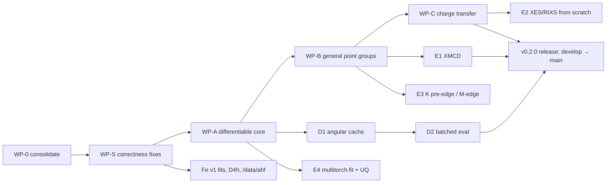

# multitorch development plan — fully differentiable port + beyond Oh/D4h

**Date:** 2026-09-09
**Branch:** `develop` (created from `d4h-transi-normalization`, HEAD `7b0c1fa`; merges to `main` when everything is done)
**Test baseline:** 539 passed / 2 skipped / 3 xfailed
**Compute:** exxa (`~/code/multitorch`, 2× RTX 4090, 128 cores, 503 GB RAM). Large outputs go to `/data/ahf/multitorch/`.

---

## 0. Where we left off (May 2026) and where we are now

### Branch state on 2026-09-09

| Branch | HEAD | Status |
|---|---|---|
| `main` | `c061f86` | v0.1.0 + Phase 1c scaffolding. Behind by 14 commits. |
| `d4h-dispatcher-v2` | `382b04d` | V2 per-D4h-irrep dispatcher. Closed BUG-001 (DS gap) and BUG #2 (label collision). Unmerged. |
| `d4h-transi-normalization` | `7b0c1fa` | Wigner-Eckart prefactor + partner-summed RME; all 13 TRANSI blocks match `nid8ct` at 1e-6. Unmerged. |
| **`develop`** | `7b0c1fa` | **New.** Contains both feature branches. All new work lands here. |

Open GitHub issues: #1 (Phase 1c dispatcher, closable), #2 (TRANSI normalization; only the "re-run the five Fe v0 fits" bullet remains).

### The two computation paths and what each can do today

| Capability | Phase 5 path `calcXAS(element, valence, sym, edge, cf, …)` | From-scratch path `calcXAS_from_scratch` / `generate_ledge_rac` |
|---|---|---|
| Angular structure | Loaded from bundled Fortran fixtures (`data/fixtures/`) | Generated in Python (CFP tables + Wigner + O(3)→Oh→D4h projection) |
| Symmetries | Whatever fixtures exist: Oh for Ti–Ni (8 ions), D4h for Ni only | `oh`, `d4h` |
| Half-integer J (odd-electron ions: Fe(III) d5, Co(II) d7, Cr(III) d3, V(IV) d1, Cu(II) d9) | Yes via fixtures (Oh only) | Oh yes; **D4h raises NotImplementedError** (no double-group tables) |
| Charge transfer | Yes (nid8ct fixture) | **No** (single configuration only) |
| Autograd | **Yes** in slater, soc, tendq, dt, ds, delta (verified today) | **Partial.** `tendq`/`dt`/`ds` carry gradients (autograd matches finite difference to 1e-8). `slater`/`soc` fail at `rac_generator.py:160` (`H += fk_ev * shell_mat`, numpy accumulator) and five sibling sites. No test protects the working CF gradient. |
| Accuracy vs Fortran | Parity at 1e-6 to 1e-12 **only at slater=soc=1 with the fixture's own CF/CT parameters.** At the default `slater=0.8` the forward model is wrong (audit S1: only the ground config-1 block is rescaled, F⁰ and the E_av constant are scaled, the 2p⁵3dⁿ⁺¹ manifold is not). Fixture-path `dt` omits the `−35·Dt/6` cross term (S2). | The quoted "0.978 cosine" is computed after an 830 eV peak shift on a window holding 66% of the intensity (audit §7.1). Root causes: HFS runs with no closed core (S3: F²dd 2.7×, G¹pd 6.8× rcn31), D4h CF blocks not one-electron-consistent + Ds sign flipped (S4), Oh dipole strengths off by triad-dependent 1.5–7× (S5). |
| Speed (single spectrum) | 20 ms (Ni) – 2 s (V d2) cached | 6–10 s; **95% is regenerating uncached angular constants** (`_complex_subduction_matrix` ×704, `wigner_D_matrix` ×16,896, `_small_d` ×1.77M per call). Four `lru_cache` decorators measured 12× (Fe d6 Oh 6.1 s → 0.5 s; Fe d6 D4h 10 s → 0.7 s). |

So the answer to "where did we end up on going beyond Oh and D4h" is: **nowhere yet, and D4h itself is only complete for even-electron ions.** The `fits/` Fe work still runs in the Oh approximation for exactly that reason (Fe(III) d5 is half-integer J). The 714 eV residual in every v0 fit is the symptom.

### What the Fortran suite could do that we cannot yet

`ttrac` reads Butler's branching library (`ttmult/inputs/disk0`), which tabulates the point groups **O, T, K, C1–C6, D2–D6, D∞** (inversion handled by parity labels, so Oh = O×Ci, D4h = D4×Ci, Td ≅ O with relabeling). pyctm only ever wrote chains for `oh`, `d4h`, `c4h`. CTM4XAS users expect at least Oh, Td, D4h, C4v, D3d, D2h, C2v.

### Known residuals carried forward

The 2026-09 scientific audit (§6) superseded the May-era understanding of these. Verified independently on 2026-09-09: halving `slater` on the fixture path shifts all Ni sticks by a rigid +43.4 eV with the span unchanged (24.383 eV both ways); `build_ban.py:118` writes raw `tendq` where pyctm writes `tendq − 35·dt/6`.

1. **S1 (fixture path, default regime).** `slater`/`soc` rescale only the ground config-1 HAMILTONIAN blocks; the excited manifold and the ligand-hole config are constants. F⁰ and the configuration-average constant are scaled too (−88.6 eV / +84.2 eV per unit). The `.rme_rcg` store has no separate G^k blocks, so the excited manifold cannot be rebuilt from fixture data: the fix needs the from-scratch two-shell exchange machinery. **Consequence: the v0 Fe fitted `slater`/`soc` values are not comparable with literature.**
2. **S2 (fixture path, D4h).** `dt` is a pure rank-4 E_θ operator, not Ballhausen Dt. One-line fix plus a test against `pyctm.write_BAN.cf_list`.
3. **S3 (from-scratch).** `tables.py:78-80` returns `'2P06 3D08'` with no closed core. Restoring it fixes F^k_dd and ζ2p to ≤1.4%; G^k_pd/F²_pd stay 2.5–2.8× and ζ3d(Blume-Watson) 1.39× → two further defects in `slater.py` / `blume_watson.py`. F²_pd omission is ~4 eV of span, not "a few tenths".
4. **S4 (from-scratch D4h).** Eg/A2g/B2g CF blocks give non-one-electron energies at dt=ds=0 (weighted means of true levels → ADD-entry/matrix-index defect in `_make_d4h_op_adds` for multi-`(J, oh_irrep, copy)` irreps); Ds sign opposite to fixture/Ballhausen. TRANSI blocks are exactly right (issue #2 closure holds).
5. **S5 (from-scratch Oh).** Dipole Frobenius² per triad off by 1.46–7.0× vs Fortran; changes normalized spectra. The D4h dispatcher's `_make_d4h_dipole_adds` is on the Fortran convention and should serve Oh.
6. **S6 (API).** All "Oh" fixtures are 2-configuration LMCT calculations applied silently (Fe: cosine 0.36 vs ionic); `delta=float` sets Δ_gs only; `delta`/`lmct` docstrings wrong; `u` ignored.
7. Must-document items (audit §8): `T` dead at `max_gs=1`; `med_energy` dead and the midpoint split gives early-3d L3 lines the L2 width; Boltzmann weights unnormalized and degenerate ground components split by rounding; legacy pseudo-Voigt η under by ~0.11 (SCA-001); `xv != 0.0` guard severs autograd at exactly-zero CF parameters; d⁰ silently ignores `slater`/`soc`; HFS `converged` flag never checked.
8. `safe_eigh` degeneracy perturbation: Cr d3 excluded from autograd tests because eigh backward gives NaN at exact degeneracies.
10. **S7 (found 2026-09-09 with a Fortran oracle; from-scratch, both paths' foundations).** `_build_hamiltonian_cowan_matrices` multiplied F^k into the rank-k *unit-tensor* SHELL blocks (crystal-field operators) and used the spin operator S as the spin-orbit operator; the excited-manifold two-shell exchange/SOC builders have the same class of error (non-uniform factors vs Fortran). eV-scale. No test covered the HAMILTONIAN operator (the 1e-6 parity test excludes it by design). Ground manifold **fixed**: `compute_coulomb_blocks` (f_k = ½⟨l‖C^k‖l⟩²[U^k·U^k − n/(2l+1)] relative to the configuration average) and `compute_soc_blocks` (V^(11) double tensor), both ×√(2J+1) (COWAN-store RME convention), match ttrcg to 3e-6 (`tests/test_angular/test_hamiltonian_operators.py`, oracle `tests/reference_data/fortran_ops/`). Excited manifold: WP-S S1b.
11. **S8 (fixed 2026-09-09).** `atomic/slater.py` divided the Y^k potential by r a second time and omitted the Hartree→Rydberg factor: F^0(1s,1s) was 0.60× the exact hydrogenic value and F^k(a,b) ≠ F^k(b,a) (p–d integrals 2.5× off). Now exact to 2e-4 on the default mesh for F^0, F^2, G^0, G^1 hydrogenic references.
12. **Bundled fixtures are Fortran runs at 80% Slater reduction** (all 8 Oh fixtures verified against regenerated pyctm runs, max |Δ| ≤ 2e-5), and their `.rcn31_out` files describe the d^(n+1) ligand-hole configuration. Therefore the fixture path's `slater=1.0` already means 80%, and its raw F^k came from the wrong configuration. Cowan's tabulated F^k come from RCN31's second pass with EXF=0.65 and his HX exchange; with EXF=0.65 the HFS port is within 1.5% (F^k dd), 6–9% (p–d), 28% (ζ3d) of Cowan. The from-scratch pipeline now uses EXF=0.65; the HX terms (`rcn31.f` KUT=−1, CA0/CA1) are WP-S S3b.
9. The five Fe v0 fits were never re-run with the V2 dispatcher, and must not be re-run until S1 is fixed. **(Re-run 2026-09-13 with S1a; see status table. v0 and v1 both ran with the fixture LMCT defaults; 200 Adam steps is unconverged; at 1000 steps some broadening widths hit their bounds, i.e. the Oh model absorbs D4h structure into lineshape.)**
13. **S1a/S1b fixture path (fixed 2026-09-13).** `build_cowan.py` now decomposes *every* HAMILTONIAN block of a store (all sections; ground d^n, ligand-hole d^(n+1)L̲, core-hole 2p⁵d^(n+1) and 2p⁵d^(n+2)L̲) as E_av·√(2J+1)·I + Σ F^k O + Σ G^k O + Σ ζ O by a joint least-squares fit over all J of a configuration, asserts elementwise residual ≤ 1e-5·max(1,|H|) (observed ≤ 7.5e-6 on all 78 configurations of the 12 bundled stores; the floor is Fortran's 6-decimal print on diagonals up to ~100 eV), and rebuilds as H_fixture + (slater/r_S − 1)·S + (soc/r_ζ − 1)·Z. `slater`/`soc` are therefore **absolute** (fraction of HF); r_S = 0.8 for every bundled store except `nid8ct_ems` (1.0), r_ζ = 1. No `.rcn31_out` is read. Findings that made it work:
    - **Fortran term phase.** Cowan's basis differs from our CFP-derived basis by σ(αSL) = (−1)^(L+S−S_min) per shell (product over shells). Invisible for d²/d⁸ (all terms have even L+S) and to Coulomb; our SHELL/SOC/MULTIPOLE builders are mutually consistent, so from-scratch spectra are unaffected. Oracle: our SHELL blocks × σ equal the stores' SHELL2 blocks to 5e-6 for d², d³, d⁵, d⁶, d⁷ (`tests/test_angular/test_cowan_operators.py`).
    - **Three open shells.** pyctm's excited ligand-hole configuration 2p⁵3d^(n+2)L̲⁹ has three open shells for 6 of 8 Oh ions. The ligand shell carries no parameters (no ζ_L, no F/G with L; the ttrcg deck omits them), so the two-shell operators are lifted with L̲ as a spectator in the ((p d) S₁₂L₁₂, L̲) S L J basis (state order: stable sort by (−S, −L)). `angular/cowan_operators.py`.
    - **Shell order** comes from the store's `%P06  D08  D10` lines (GROUND then EXCITE per section); `nid8ct` is valence-first in sections 0 and 3, `nid8`/`als1ni2` are core-first despite being ttmult examples.
    - **ttmult examples** print unreduced HF values in their headers but ttrcg applies 80% internally (fitted F² = 9.7872 = 0.8000 × 12.2341); `nid8ct`'s G³ is at 64%, so only the relative rescale is uniform there. `nid8ct_ems` (RIXS emission) is at 100% while its absorption partner `nid8ct` is at 80%. `calcRIXS` still takes the emission side from the Fortran `nid8ct_ems.ban_out` (not rebuilt), so its absorption and emission Slater reductions differ (0.8 vs 1.0) unless the emission side is moved onto the rebuilt `_ems` store (open).
    - **Transition sections 0/1** of 4-section stores carry parameter-free HAMILTONIAN blocks (the deck has no `state` lines for them); only sections 2/3 feed the assembler.
    - **Oracles** (`tests/test_hamiltonian/test_build_cowan.py`, data in `fortran_ops/oh8_rcg/` and `oh8_s1.0_hamiltonian.npz`, built by `tests/tools/build_oh8_oracle.py` from `/data/ahf/multitorch/fixtures/oracle_oh8`): every fitted coefficient equals the ttrcg input parameter it multiplies (≤ 1.3e-5 eV, all 8 Oh ions, sections 2/3); the 0.8 store + Σ(p₁.₀ − p_fit)·O reproduces the Fortran 100% eigenvalues to ≤ 9.8e-6 eV. **The requested "slater=1.0 to 1e-6 eigenvalues" is not attainable through `slater` alone:** pyctm rounds every RCG input to 3 decimals, so round(0.8F)/0.8 vs round(F) differs by up to 5e-4 eV per parameter and the public `slater=1.0` rebuild agrees with the Fortran 100% run to ≤ 4.7e-4 eV (tested against the per-block Weyl bound of that rounding).
    - Consequence for users: the fixture-path default `slater=0.8` is unchanged in value but now means 80% of HF everywhere; code that passed `slater=1.0` to mean "the fixture as-is" must pass 0.8. `calcDOC` and `calcRIXS` (fixture mode) defaults moved from 1.0 to 0.8 for the same reason.
14. **Cr³⁺ fixture path vs Fortran `.ban_out` (fixed 2026-09-15: the assembler now uses copy k of a triad listed k+1 times in the .ban; before, both PRMULT copies of S1+→S1− were assembled from copy 0, which Mn²⁺/Fe³⁺/Co²⁺ tolerate because their two copies carry equal intensity, and Cr³⁺ does not. Now cosine 0.99999999, and the dipole sum rule `tests/test_spectrum/test_dipole_sum_rule.py` holds for every fixture; found by that invariant, FABLE_HANDOFF_2026-09-15 R14. Original entry follows.) (found 2026-09-13 by the S7 union-window metric).** Phase 5 at the fixture's own reductions agrees with the bootstrap `.ban_out` to cosine ≥ 0.99999997 for Ti⁴⁺, V³⁺, Mn²⁺, Fe²⁺, Fe³⁺, Co²⁺, Ni²⁺ and nid8ct, but Cr³⁺ is at 0.9889 (max|Δ| 0.19 of the peak, area 1.002), independent of T and max_gs and with no ground-state degeneracy (S1+ gap 2 eV). The old test excused it as "degeneracy rounding" at a 0.98 threshold. Observations: the two PRMULT copies of the S1+→S1− triad are assembled from copy 0 (`read_ban` drops the copy index, `_find_transi_block` returns the first match), and phase 5 builds 7770 S1− final states where ttban printed 2730; both also hold for Mn/Fe³⁺/Co (3810 vs 1410), which match, so neither alone explains Cr. Next step: per-triad stick comparison for Cr against the `.ban_out`.
15. **~~max_gs=1 and near-degenerate ground levels~~ (CLOSED 2026-10-18).** `get_sticks`/`get_sticks_from_banresult` counted levels by exact float equality, so a symmetry degeneracy scattered by `eigh` counted as several levels and a `max_gs` truncation cut through one physical level. Closed by pooling at level boundaries: `spectrum/sticks.LEVEL_WINDOW_EV` = **1e-5 eV**, with `_ground_level_pool` grouping by the same *anchored* rule `analyze_ground_state` already used for `degeneracy_tol` (a state joins the open level while it is within the window of that level's **first** member, so a ladder cannot chain one level arbitrarily wide), and **every member weighted by the level's energy rather than its own** — which is what makes the dipole sum rule an exact integer, where per-state weights scatter it by ~1e-4 at 80 K against the sum rule's 1e-6 tolerance. `level_window=0.0` restores the old counting bit for bit and is what the injected-bug tests use.

    **The number is measured, not inherited.** Survey on 2026-10-18 over all eight bundled fixtures in both regimes plus the from-scratch Oh/D4h paths with and without CT (24 cases): the components of a degenerate ground manifold scatter by at most **8.0e-7 eV** (Fe³⁺ d5 from scratch; the Fortran stores give 1.7e-8 to 2.4e-8, and the real Mn²⁺ ⁶A₁g cubic ZFS is 2.8e-7), while the narrowest genuinely distinct pair of ground levels anywhere in the survey is **7.0e-5 eV** (the Fortran `nid8ct` axial splitting, 0.56 cm⁻¹). 1e-5 eV sits an order of magnitude clear of both ends, and **all 24 cases give the same level 0 at 1e-5 as at 1e-4**, so the sticks pool and `analyze_ground_state` agree by construction. A window of 1e-6 is *not* enough — Fe³⁺ Oh + CT needs ≥ 1e-5.

    **The kT-based window this entry used to suggest was tried and rejected.** 1 % of kT reaches the `nid8ct` 7.0e-5 eV gap at 81 K, so the pool *count* would jump as T crossed it — a discontinuity in T in every spectrum, worse than what it replaced. The thermal argument survives as a bound rather than a definition: members of one level are misweighted by at most window/kT, 0.8 % at 15 K for the window and 0.06 % for the spreads actually measured. **Ties to D-1 but does not disturb it**: weights stay unnormalised. It does *not* leave the `.ban_out`/pyctm path untouched, however — see residual 37; `get_sticks`, `calcXAS` and `getXAS` take `level_window` so that path can be driven at pyctm's own convention, which is what `test_tm_series.py` does.

    Oracles, all of which failed before and pass now: the **five strict xfails** of `test_dipole_sum_rule.py::test_*_counts_every_ground_component` (Mn²⁺ and Fe³⁺ Oh on the fixture and from-scratch paths, and Fe³⁺ Oh + CT) counted **2 of 6** ground components and now count 6; the Fe³⁺ D4h + CT Oh-limit spectrum went 0.99969 → **0.99999999999** (its two-sided bound from the P3 close-out is what reported it); and the Oh-vs-D4h comparison is now made at every pool depth **and on absolute intensity** (`test_oh_and_d4h_agree_at_every_pool_depth`), which residual 15 had restricted to `max_gs=1` and shape only. See residual 36 for what that comparison turned out *not* to have been about.
16. **Findings behind S6/S7 (2026-09-13).** (a) `med_energy` was ignored everywhere (the L3/L2 width switch always used the stick-range midpoint): honoring pyctm's value (25) takes the Ti⁴⁺ comparison with the pyctm `.xy` from cosine 0.978 to 0.99996 and every ion to ≥ 0.99992 on pyctm's grid; the Ti "known limitation" in the README/tests was this bug. (b) `delta=float` left EF2 at the template, `u` was dropped, and `mlct` overwrote V(t2g); now EG2 = Δ, EF2 = Δ − u (pyctm), `u` wired, `lmct` accepts channel names, `mlct` raises. (c) Zero-intensity sticks (e.g. the V = 0 ligand-hole manifold 100 eV up) set the auto window. (d) A crystal-field or hopping tensor exactly at 0 had no gradient. (e) The D4h from-scratch vs Fortran nid8ct gap (union cosine 0.969) is entirely the HFS atomic parameters (S3b): with nid8ct's own fitted parameters the generator reproduces the store at 0.99999992.
17. **From-scratch excited manifold gauge (fixed 2026-09-13).** The 2026-09-10 claim "from-scratch reproduces Fortran for even-electron ions" had been verified for Ni d⁸ only. With each fixture's own parameters (from the S1a decomposition) V³⁺ d² was at cosine 0.853 and Fe²⁺ d⁶ at 0.991. Block-by-block against the Fortran store: ground HAMILTONIAN/CF and excited HAMILTONIAN match under the term gauge σ = (−1)^(L+S−S_min), but the excited CF (`compute_two_shell_shell_blocks`) and MULTIPOLE blocks match only with an extra σ on the excited valence term, i.e. those two builders already work in Cowan's term phase while `compute_two_shell_operators` does not. The excited manifold was therefore internally inconsistent whenever the excited d shell is multi-term (every ion but Ni²⁺, whose 3d⁹ is single-term). Fix: `_build_excited_hamiltonian_cowan` applies σ of the valence term. V, Fe²⁺ and Ni now agree with Fortran in stick energies (≤ 2.4e-6 eV), absolute intensities (≤ 1e-5) and spectrum (cosine > 0.99999), Oh and D4h (`tests/test_integration/test_from_scratch_fortran_parity.py`, red without the fix). Half-integer ions with the same parameters: Cr³⁺ 0.73, Mn²⁺ 0.91, Fe³⁺ 0.88, Co²⁺ 0.75 cosine with total intensity 2.2–3.3× Fortran (legacy Oh coefficients, WP-B).
18. **Unnormalised Boltzmann weights put a kink in the spectrum at every ground-level crossing (found 2026-09-13 during A5; kept by decision D-1, see "Deferred decisions" below).** `get_sticks*` weights by `exp((E_min − E_g)/kT)` without dividing by the partition function, exactly as pyctm (`pyctm/get_spectrum.py:84`). The total weight Z·exp(E_min/kT) is then non-differentiable wherever the lowest ground branch switches, e.g. the D4h Oh limit dt = 0: from scratch, Ni²⁺ at T = 80 K, max_gs = 40, the weighted loss has one-sided slopes +2.41 / −5.55 (normalised to L) and its area peaks at dt = 0. Autograd returns one side, central FD their mean (−1.57); neither is "the" derivative. Dividing by the pool partition function makes both slopes −1.574. **Consequence:** the planned A5 oracle (FD at dt = ds = 0 and at soc = 0) cannot pass on the current forward model; with max_gs = 1 the same points are also discontinuous (residual 15, FD ≈ ±5000). Normalising changes absolute intensities by 1/Z (a global factor per spectrum, spectral shape unchanged) and departs from pyctm: **decided 2026-09-13 to keep pyctm's convention for now (D-1).** Away from exact crossings (dt = ds = 1e-3, soc = 1e-3, Cr³⁺ Oh fixture) autograd already matches FD to ≤ 3.5e-6 with the current `safe_eigh`.
19. **The A5 design as written would be wrong at exact degeneracy (found 2026-09-13).** For a loss tr(f(H)A) (Boltzmann-weighted intensities are of this form) the exact gradient has Daleckii–Krein divided differences (f(λ_i) − f(λ_j))/(λ_i − λ_j) → f′(λ) on degenerate pairs. `eigh` backward only sees (Uᵀ∂U)_ij, whose antisymmetric part carries f(λ_i) − f(λ_j) = 0 at exact degeneracy, so a Lorentzian-regularised 1/(λ_i − λ_j) drops the f′·A_ij term (basis-dependent result whenever A is not ∝ I on the degenerate space, e.g. accidental degeneracies of copies inside one irrep block, or ζ = 0). The existing 1e-12·linspace diagonal perturbation splits the pair by δ and so recovers f′ to O(δ) — it is closer to right than the Lorentzian. Its real defect is that it shifts the *forward* eigenvalues only when `requires_grad`, so grad and no-grad evaluations can count ground levels differently under residual 15. Recommended A5 instead: exact forward (no shift) + backward that perturbs only inside the backward, or wait for residual 18/15 decisions.
20. **From-scratch parameter vocabulary after A1/A2 (2026-09-13).** Operators are keyed by shell index (`F2_11`, `F2_12`, `G1_12`, `zeta_2`) with unambiguous shell-letter aliases (`F2dd`, `F2pd`, `G1pd`, `zeta_p`) for `atomic` overrides; the Rydberg dicts (`'F2'`, `'F2_dd'`, `'G1_pd'`, `{'p','d'}`) survive only as the input format of `generate_ledge_rac` / `_hfs_to_slater_params` (`ledge_reference_ev` converts). A3 is reduced to retiring those dicts and `ConfigParams`/`ScaledConfigParams`. HFS is ~0.7 s of the 0.8 s from-scratch call and is now cached per ion. The unknown-cf-key check exposed `test_d4h_collapses_to_oh_when_dt_ds_zero` passing `{'10dq': 1.0}` (silently ignored since written; the default is also 1.0).

21. **From-scratch D4h depended on the machine's LAPACK (fixed 2026-09-14).** `_oh_irrep_matrices_real_std` took the Oh E-irrep partner basis from `np.linalg.eigh` of a projector whose eigenvalue-1 space is two-dimensional. Every rotation there is a valid Oh basis, but the partner-resolved Oh→D4h subduction needs partner 0 ∝ d(x²−y²) and partner 1 ∝ d(z²) *with equal signs*; macOS Accelerate happened to return an admissible basis, exxa's LAPACK did not. On exxa the same commit gave Ni d⁸ D4h ground levels 0.27–0.64 eV off the Fortran nid8ct store at Dt, Ds ≠ 0 (Oh limit correct everywhere), so **the three v2 D4h fits run on exxa are invalid**. Every D4h test sat at the Oh limit or had no multiplets. Fix: the E basis is pinned to (d(x²−y²), d(z²)). Oracles: Ni D4h from scratch vs the Fortran store at two (10Dq, Dt, Ds) points (≤ 2e-5 eV), and the same with eigenvectors randomly rotated inside every degenerate subspace in a fresh process (`tests/tools/lapack_scramble.py`; seed 2 reproduced exxa's wrong levels exactly before the fix). Fe²⁺/V³⁺ Oh and D4h spectra are invariant to the scrambling to ≤ 2e-12. **Hidden sign convention fixed 2026-09-15.** The D4h Dt operator is the Butler-weighted sum of two routes (Oh A1 and Oh E at rank 4), each built from eigen-decompositions with arbitrary sign; the Ballhausen pin fixed only the sign of the sum, so their *relative* sign was LAPACK's choice. Flipping eigenvector signs (which LAPACK builds also do differently, not only rotations in degenerate spaces) broke Dt by up to 1.6 eV. Each route is now pinned to a positive m = 0 real-harmonic component, the convention the Butler coefficients were calibrated to; with it an E-partner sign flip is harmless. The scramble harness now also flips every eigen/singular vector sign and is deterministic per input matrix (a non-deterministic scramble falsely broke uncached, repeated calls). Oracle: Ni D4h vs Fortran at four (10Dq, Dt, Ds) points incl. Ds-only and Dt-only, unscrambled and for two scramble seeds; without the route pin seed 2 fails at 0.66 eV. WP-B's general `PointGroup` must gauge-fix every operator vector the same way. Diagnosis recipe (reusable): scramble one calling function at a time (`install(seed, only=name)`) over several seeds, then check the failing site's outputs: basis vectors (gauge, harmless if shared) vs operator vectors (physical, must be pinned).
22. **Half-integer fixtures assembled phantom configurations (fixed 2026-09-14, commit 5f88e9c).** `_get_config_dims_from_transi` counted each PRMULT copy of a triad's TRANSI block as a configuration, so the Γ8 irreps of Cr³⁺, Mn²⁺, Fe³⁺, Co²⁺ carried duplicated, dark, un-offset ligand-hole blocks (Fe³⁺ final block 3810 states vs ttban's 1410). Spectra were unchanged (recomputed v2 Oh fit losses identical to 1e-12), cost ~20×, and ground-level listings contained phantom levels. Cr³⁺ residual 14 is unchanged by it, and the "Cr d³ 1074-dim Hamiltonian" autograd exclusion in `test_phase5_multi.py` referred to the inflated size (true size 372); both need a fresh look.
23. **Ground-state character is now computed, not inferred (2026-09-14, commit af66e65).** `multitorch.analysis.analyze_ground_state` gives ⟨S²⟩, term and configuration weights of the lowest levels for fixture and from-scratch caches; `fits/analyze_ground_states.py` runs it on fit results. On the v2 Oh fits it shows the FePc and FeTPC-Cl (as Fe(II)) octahedral fits sit on the high-spin/low-spin crossover (a singlet and a quintet within 0.1–9 meV), not in a well-defined spin state.

24. **Charge-transfer store operators: Fortran sign rules (2026-09-15, WP-C C1–C3).** Every ttrcg charge-transfer block is now generated in the Fortran store basis and matched elementwise against all eight two-configuration fixtures (`angular/cowan_operators.py`, `tests/test_angular/test_{ct_operators,shell_tensor_operators}.py`). The rules, none of which is a free fit: SHELL (crystal field on the metal) = σ·M·σ with no block phase (rtol 1e-6, ttrcg single precision); ground-manifold hopping = (−1)^n σ_bra·M·σ_metal(−1)^(S+L); final-manifold hopping (core-hole spectator, Edmonds 7.1.8 on the second member) = −σ·M·σ; dipoles = (−1)^m σ·M·σ·(−1)^(S_c+S_m−S+L_c+L_m−L) (MUPOLE couples metal before core). nid8ct's valence-first 2p⁵3d⁹ maps onto the core-first basis by the coupling swap and the fermionic (−1)^(n_a n_b), an independent check.
25. **nid8ct final-state print precision (2026-09-15).** nid8ct prints its 2p⁵ blocks around E_av = 860 eV, so the exactly degenerate 2p⁵ 3d¹⁰ L̲ levels scatter by ±9e-5 eV in the Fortran store itself (Oh stores, E_av = 20 eV: 1e-6). Charge-transfer parity against nid8ct holds final levels to 2e-4 eV only; ground levels and the Oh fixtures to ≤ 2e-5 eV.
26. **ttrac Butler route phases (2026-09-15, WP-C C4).** The hybridisation actors are route sums with pyctm's strengths; with routes pinned to m = 0 positive, ttrac's rank-2 E route has the opposite phase (the same fact the Ballhausen pin on DS encodes). Analytic oracle: each actor is √5 × its one-electron orbital projector (`test_hybridisation_channels_project_onto_their_orbitals`). The Oh dipole sign triple must be shared by both configurations of a CT calculation (`ranked_triples`).
27. **~~From-scratch charge transfer is integer J only~~ (2026-09-15; CLOSED 2026-09-24 by WP-B2a-5).** `generate_ct_ledge_template` used to raise for odd n (Cr³⁺, Mn²⁺, Fe³⁺, Co²⁺); it now emits the four-configuration structure for every **2 ≤ n ≤ 8** in Oh and D4h (d¹ is the one refusal, residual 33 — the "1 ≤ n ≤ 8" first written here on 2026-09-24 was wrong and was corrected on 2026-09-25 after a review found d¹ raising a CFP error). The note this entry carried for that increment held up: a CT calculation's two configurations feed the *same* TRANSI triad, so their dipole blocks are written in one channel basis — one `real_invariant_coefficients` call over the pooled pairs of both configurations (`_oh_dipole_channels_half` / `_d4h_dipole_channels_half`), the half-integer counterpart of the shared `ranked_triples` of residual 26. The cross-configuration *hybridisation* gauge, flagged as the likely hard part, cost nothing: see residual 32. Ligand-hole HFS parameters follow pyctm (one more 3d electron), with the ~2 % HX offset of S3b in the absolute values.
28. **Two-shell state gauge was wrong for odd electron counts (found and fixed 2026-09-17, commit 92b9542).** `compute_two_shell_shell_blocks` phased each state by (−1)^(S_total+L_total), which is Cowan's term gauge only when the configuration has an even electron count; for an odd one every block came out globally negated. The excited crystal field of Cr³⁺, Mn²⁺, Fe³⁺ and Co²⁺ was therefore upside down (eg and t2g swapped; final levels off by up to 1.2 eV), while the integer-J ions were unaffected — which is why the integer parity tests never saw it. Fix: subtract S_min = (electrons mod 2)/2. The generator's blocks now equal the elementwise-validated `shell_tensor_blocks` (WP-C C2) to 2e-16 for both parities. **Two more sites in `rme.py` used the same idiom.** The second was `compute_multipole_blocks` — residual 30, found on the half-integer path two days later. The third (the two-shell SOC and exchange builders, ~lines 1510 and 1670) keeps the raw idiom — see the correction in residual 30, which this entry originally got wrong.
31. **The D4h subduction routes carry a free phase (found and fixed 2026-09-19, WP-B2a-4).** The crystal-field operators DT and DS are scalars in D4h but not in Oh, so their matrix elements connect *different* Oh double irreps — a coupling the B2a-1 gauge walk never had to make real, and did not. The obstruction is not physics: the partner-0 vector of each (Oh irrep → D4h irrep) subduction route has an overall phase that no group-theoretic condition fixes (a Condon–Shortley-style convention), and `eigh` was choosing it. In the shipped Oh gauge every reduced element was already real except the E5/2 ↔ G3/2 ones in the E3/2 channel, which all carried *one* constant phase (131.971°, the same for d1 and d3 — the signature of a single free constant rather than a per-state defect). `_pin_d4h_routes` fixes one phase per route by requiring a cross-route element to be real, and `_check_d4h_reality` then tests every element: all real to ~1e-14 for d1, d3, d5, d7, d9. The constant itself is a LAPACK output and is never hard-coded; the scramble harness covers it. A Γ8 pair constrains one phase difference with two reduced elements (its E1/2 and E3/2 channels), which could have been an over-determination — measured, they always agree modulo π, so it is not.
30. **The MUPOLE blocks' excited-term gauge was wrong for odd electron counts (found and fixed 2026-09-19, WP-B2a-3).** The same defect as residual 28, at the second of the three sites: `compute_multipole_blocks` phased each excited two-shell state by (−1)^round(S_total+L_total+1). For an odd electron count that exponent is a half-integer, so `round` gives whatever the rounding rule does — banker's rounding sends every half-integer to an even number, i.e. a uniform +1 — and the dipole's excited states were signed arbitrarily *relative to the excited crystal field*, which carries the same gauge correctly. Symptom, and a useful signature for this class of bug: totals exactly right (the dipole sum rule holds, and Σ c²·n_bra·n_ket matches ttrac per J sector), the final-state distribution wrong — cosine 0.62 (Cr³⁺), 0.75 (Co²⁺), 0.9999 (Mn²⁺, Fe³⁺). Closure over the final manifold makes Σ_f|⟨f|D|g⟩|² blind to ket-side signs, so only the spectrum sees it. Fix: `rme.cowan_term_gauge`, now shared by both sites; `cowan_operators.hopping_blocks` composes with it instead of compensating for the old form. The third site (two-shell SOC and exchange, ~lines 1510 and 1670 of `rme.py`) still uses the raw idiom. **Corrected 2026-09-25 (WP-B2a review):** residuals 28 and 30 both claimed that site "carries the gauge on both sides, where it cancels, and the half-integer levels prove it right". Both halves are false, and both were verified false. (a) The shift does not cancel: σ_a σ_b = (−1)^(−2S_min)·(−1)^(L_a+S_a+L_b+S_b), so for an odd electron count (S_min = ½) it is a **global −1** relative to the raw idiom, not a cancellation — the same global −1 residual 28 fixes at the first site. Measured on p⁵d⁴: ratio −1 for every state pair. (b) The named oracle cannot reach it: `compute_two_shell_soc` and `compute_two_shell_exchange` have **zero call sites** in the package or the tests (only their own `def` lines and two unused imports in `rac_generator.py`), having been superseded by `compute_two_shell_operators`, which carries no `phase_conv` at all. So the half-integer levels are not their oracle and never were. The correct statement is: **dead code, un-migrated, and wrong for odd n if revived.** Anyone wiring either builder into the excited manifold under WP-S S1b must apply `rme.cowan_term_gauge` first.
32. **The cross-configuration gauge was free, and D4h + CT at half-integer J has no Fortran oracle (2026-09-24, WP-B2a-5).** Two findings from the last B2a increment.

    (a) *The gauge.* The hybridisation actors (EGHYBR/T2GHYBR in Oh, b1/a1/b2/e in D4h) are point-group scalars connecting gs↔gs_lh and ex↔ex_lh, i.e. two **different configurations** — the shape of gap residual 31 was for D4h, and the one place B2a-5 was expected to need new machinery. It needed none. The partner vectors of `double_group.gauged_basis` depend on (J, irrep, copy) and not on the configuration, so giving both configurations of a parity **one shared node set** (nodes labelled `'g'`/`'u'`, J values unioned over that parity's two configurations) makes the cross-configuration couplings real by exactly the argument that already covered the intra-configuration ones. It is verified per element rather than assumed (`_gauged_transfer_element` raises on a complex coefficient), and all four odd-electron Fortran CT oracles passed on the first run. **The lesson worth keeping: the configuration label never enters the angular problem, so it must not enter the gauge graph either.** A node set per configuration would have been the natural-looking design and would have been wrong.

    (b) *The missing oracle, and what closed it (revised 2026-09-25 after the WP-B2a review).* D4h **with** charge transfer at half-integer J has no Fortran reference at all — ttrac cannot be re-run (plan B6) and no bundled fixture is both tetragonal and odd-electron. **The first version of this entry named the dipole sum rule as an oracle "away from that limit", and that was wrong:** the sum rule is crystal-field-blind by construction (its own docstring says it holds independent of the crystal field), so it cannot pin a tetragonal answer at all. The 2026-09-25 scientific audit demonstrated the gap by injecting a DS sign flip — residual 21's bug class, worth up to 1.6 eV — and watching it pass *every* half-integer D4h test then in the suite: the sum-rule ratio was identical to nine digits, the level-splitting test passed, the Oh-limit test is blind to it (ds = 0 there), and the reality checks and scramble harness did not fire. Roughly 500 rank-2 (DS) coefficients of an odd-electron D4h RAC had no oracle of any kind. **Closed 2026-09-25** by extending the analytic Ballhausen one-particle test (`tests/test_hamiltonian/test_cf_one_electron.py`) to d¹ and d⁹: one electron or one hole in the field gives the five one-particle energies directly, both ions have half-integer J, and the check is Fortran-free and runs in ~2 s. Verified to have teeth — the injected DS sign flip fails it by 0.24 eV. The current oracle set for this regime is therefore: that analytic test (magnitudes and signs of TENDQ/DT/DS), the Oh limit dt = ds = 0 against the ion's own Oh fixture with CT on (`test_half_integer_d4h_charge_transfer_reproduces_the_oh_limit_*`), a level-splitting test that now varies **one** tetragonal term at a time (the earlier version varied dt, ds and the hybridisation together and passed with DT and DS inert — measured, the hybridisation change alone gives 0.172 eV against a 0.02 eV threshold), and the LAPACK-scramble harness, which since 2026-09-25 also applies complex phases and unitary mixing (the freedom a complex-Hermitian `eigh` actually has) and runs the half-integer path *away* from the Oh limit. The Oh limit is *exact* rather than approximate because B1HYBR + A1HYBR = EGHYBR and B2HYBR + EHYBR = T2GHYBR term by term in `HYBR_ROUTES`, so equal V within each pair is the Oh hybridisation. **That limit must be taken at `max_gs=1`:** the ground pool is a truncation by *level*, and D4h splits each Oh level in two, so at `max_gs=40` the two sides hold different physical states and the cosine falls to ~0.70 for the long-validated **integer** ions too (V³⁺ d² measured at 0.6987) — residual 15/D-1, not a statement about the path. At `max_gs=1`: Cr³⁺ and Co²⁺ cosine 1.00000000, Fe³⁺ 0.99969 (residual 15 again, the d⁵ six-component ground manifold; xfailed strict). Absolute intensity is not comparable across the two labelings either — the Cr³⁺ Oh side counts two ground components where the D4h side counts one, an exact factor 2 — so the sum rule pins the scale instead.

33. **Charge transfer from scratch cannot do d¹ (found 2026-09-25 by the WP-B2a review; open, refused cleanly).** d¹ has J = 3/2 and 5/2 only, which branch to G3/2 and E5/2 ⊕ G3/2 — **no E1/2 (Γ6) at all** — while its ligand-hole partner d²L̲ has J = 1/2 and does carry E1/2. So that ground irrep exists in the *second configuration only*, and the assembler reads a triad's per-configuration dimensions from the order of its TRANSI blocks, taking a lone block for configuration 1; a one-sided triad cannot be expressed. `_emit_transi_group` refuses it. Supporting d¹ needs a dimension-carrying placeholder for the absent configuration in both the generator and `_get_config_dims_from_transi`. Until then `ct_configurations` raises `NotImplementedError` naming the reason; the supported range is 2 ≤ n ≤ 8, and Ti³⁺/V⁴⁺ + LMCT is out of reach. Found behind a separate off-by-one, now fixed: `cowan_operators.hopping_blocks` guarded its no-parent branch with `n_metal > 0`, so a single metal electron looked up the non-existent l⁰ CFP table and raised `No CFP data for l=2, n=0` — the guard is `n_metal > 1` and the n = 1 blocks are now built, though with no Fortran oracle (no bundled d¹ two-configuration fixture).

34. **`calcDOC` double-counts ground states across triads at half-integer J with CT (found 2026-09-25 by the WP-B2a review; open, does NOT affect the published fits).** `_calcDOC_phase5` (`api/calc.py`, the configuration-weight diagnostic) iterates `result.triads`, and there is one `TriadResult` per `.ban` triad *listing* — i.e. once per (gs_sym, fs_sym) pair **and** once per PRMULT channel copy. A ground irrep appearing in more triads, or carrying two invariant channels (Γ8 ⊗ T1u ⊗ Γ8), is weighted more heavily than one that does not, so the reported configuration weights are biased. **`multitorch.analysis.analyze_ground_state` is not affected** — it goes through `assemble_ground_hamiltonians`, which dedupes by `gs_sym` (`if gs_sym in out: continue`) and builds each ground irrep exactly once. That is what `fits/analyze_ground_states.py` and the v5 Fe report use, so the published spin states and configuration weights stand; the defect is confined to the `calcDOC` API. Fix: dedupe by `gs_sym` there too, or weight each triad by 1/(number of listings of its ground irrep).

35. **ttrac writes the Oh dipole geometry as MULTIPOLE, not PERP/PARA, and the assembler now matches it exactly (2026-10-18, WP-B2a review P3 close-out).** `assemble._find_transi_block` tried an exact geometry match and then fell back to a geometry-blind one, and the caller asked for `'PERP'` for every act_sym `'1-'`. In Oh that exact match is **always empty** -- every bundled Oh fixture (`ti4_d0_oh` … `ni2_d8_oh`, the four odd-n CT ones included) labels its dipole blocks `MULTIPOLE`, and only the D4h fixture `nid8ct` uses `PERP`/`PARA` -- so Oh silently ran on the blind match with the block dimensions as its only discriminator. The review suggested changing the Oh CT *generator* to emit `'PERP'`; that would have been backwards, since `MULTIPOLE` is ttrac's own Oh convention and the generator was already following its oracle. Fixed at the assembler end instead: `_find_transi_block` takes an ordered `geometries` tuple (`('PERP', 'MULTIPOLE')`, `('PARA', 'MULTIPOLE')`), so the exact match fires in both groups and the blind fallback is a last resort rather than the Oh path. Behaviour-preserving -- no Oh block carries act_sym `'1-'` under any other geometry -- so this is a tightening, not a fix for a wrong number. **The silent-failure trap it was masking is now refused outright:** `_get_config_dims_from_transi` raises when a triad's per-configuration `(n_bra, n_ket)` pairs collide, because `_find_transi_block` takes no configuration argument and separates the configurations by dimensions alone, so equal pairs would hand configuration 2 configuration 1's transition block. The pairs are distinct for every reachable n × symmetry today -- at n = 8 the final-manifold dims already coincide in every irrep and only the ground dims keep them apart -- which is why nothing had exercised the failure; `test_assemble_dims.py::test_configurations_of_equal_dimensions_are_refused` injects the collision into the Ni Oh fixture and watches it raise.
36. **The "Oh vs D4h cosine 0.70" figures were a dark-stick alignment artifact, not residual 15 (measured 2026-10-18).** Residual 15 and the WP-B2a test comments recorded that an Oh-vs-D4h Oh-limit spectrum comparison "must be taken at max_gs=1 or the cosine falls to ~0.70 even for long-validated integer ions (V³⁺ d² measured 0.6987)". Re-measured with the two sides aligned on the lowest **bright** stick, the way `_assert_matches_fixture` has always aligned them, the shape cosine is **1.0000000 at every ion and every depth — even with exact-float level counting**. The collapse comes from normalising on `E.min()`: D4h splits the final manifold into more irreps than Oh and therefore lists ground-final pairs Oh does not have, the lowest stick *overall* is one of those dark pairs, and aligning on it shifts the whole D4h spectrum by 1e-2 to 3e-2 eV. Aligning on `E.min()` gave cosine 0.104 (Co²⁺ d7, max_gs=40), 0.212 (Cr³⁺ d3), 0.450 (Fe³⁺ d5), 0.595 (Fe²⁺ d6); aligning on the lowest bright stick gives 1.0000000 for all of them at max_gs 1, 10 and 40. **What residual 15 actually cost was the intensity scale, not the shape**, and it cost it as an exact rational factor: at `max_gs=1` the D4h/Oh ratio was exactly **1/2** for V³⁺ d2 (1 of 2 ground components kept) and **2/3** for Ni²⁺ d8 (2 of 3) — which is residual 15's own "keeps 2/3 of the degenerate ground level", now measured. Both are 1.0000000 after the fix, and both are pinned as the injected bug by `test_exact_float_level_counting_loses_part_of_the_degenerate_ground_level`. Lesson for any future cross-group comparison: **align on a bright stick, never on the extremum of the stick list**, because the two groups do not have the same dark pairs.
37. **Closing residual 15 changes the d5 fixture spectra against pyctm, in shape as well as scale, and pyctm's is the partial one (2026-10-18).** pyctm's `get_spectrum` counts Boltzmann-pool levels by exact float equality, so for an ion whose ground level is scattered *within* the level window it pools fewer components than multitorch now does. Mn²⁺ and Fe³⁺ are exactly that case — their 6-fold ⁶A₁g sextet is split by 2.4e-8 eV in the Fortran stores, of which exact-float counting keeps 2 — so against the bundled pyctm `.xy` references the default window gives **area ratio 3.000** and, importantly, **cosine 0.99592 (Mn²⁺) / 0.99633 (Fe³⁺)**: not a rescaling. The six components each carry the same *total* intensity (the dipole sum rule holds per component) but distribute it differently over the final manifold, so summing all six is the isotropic spectrum and summing whichever two share a float is not proportional to it. **The sum rule says ours is the right one**: ΣI / (0.2·n_h) is an exact integer only at 6, which is what the five xfails of residual 15 were. The other six ions are unaffected (their ground level is a single float, so the pool is identical and the spectrum agrees stick for stick). Handling: `get_sticks`, `_calcXAS_from_ban`, `_calcXAS_phase5`, `calcXAS` and `getXAS` all take `level_window`, and `test_tm_series.py::test_tm_series_getXAS_runs` keeps the pyctm oracle at full strength by running it at `level_window=0.0` while asserting the default-window ratio and cosine band as measured facts. **The published Fe work is not affected, and this was measured rather than assumed.** `fits/fit_v2.py` pools at its defaults T = 15 K, `max_gs = 20`, where both poolings already contain the whole sextet (exact-float counting splits it into the *two lowest* distinct floats, so a 20-level pool reaches both) and the next level is ~2.8 eV up, i.e. e^(−2.8/kT) ≈ 0 at 15 K. Measured on the fixture path at that pool: Fe³⁺ cosine **0.9999999998**, area ratio **1.00026** (max |Δy| 9.8e-4 on a peak of 3.72, so 2.6e-4 relative); Mn²⁺ cosine 1.0000000000, ratio 1.00010; Fe²⁺ bit-identical. Both are orders of magnitude below any fit's sensitivity, and `analyze_ground_state` — which the v5 report and `fits/analyze_ground_states.py` use for spin states and configuration weights — has no reference to `sticks` at all (checked), so it cannot be touched. The same ions at `max_gs = 1` move by ratio 3.02 and cosine 0.988/0.992, which is the measure of how shallow a pool has to be for residual 15 to matter. Still: **do not compare a d5 L-edge absolute intensity across 2026-10-18 without checking which pool it used.**
38. **`point_group.oh_subduction_matrix` is dead code and its degenerate-irrep subspaces are wrong (found 2026-10-18 by WP-B2; open, deliberately not fixed).** The plan named it as B2's oracle. It is **not usable as one**: it has **no call sites** in the package or the tests, and its row projector is `gamma_mats[R][nu, mu]` where the correct one — the one the *production* `_real_subduction_matrix` uses two screens further down the same file — is `gamma_mats[R][mu, nu].conj()`. Summed over the group the index swap is harmless for a one-dimensional irrep (the single diagonal element *is* the character, and A1/A2 come out exact) and wrong for a degenerate one, so `P[0,0]` selects the wrong partner-0 subspace and the columns built from it do not span the isotypic subspace. Measured against the gauge-free character projector (idempotent to 1e-16, correct rank, projectors summing to the identity to 3e-16): off by **0.19 (J=2 E and T2), 0.92 (J=3 T1/T2), 0.74 (J=4 T1)**, while the new `finite_group` subduction matches that projector to **1e-16** and the production `_real_subduction_matrix` to **8e-15**. The function also hides the failure — it has a `np.linalg.qr` fallback that re-spans whatever columns it got and then an orthogonality assert that passes. **Not fixed because nothing uses it**; deleting it is a judgement call for WP-B5, which retires that whole layer anyway. `test_finite_group.py::test_dead_oh_subduction_matrix_disagrees_with_the_character_projector` pins the defect so that anyone reviving the function finds out, and so that B2's oracle is not mistaken for it again. **Lesson for the rest of WP-B: check that a named oracle is actually on the validated path before trusting it** — `grep` for call sites first.
29. **Half-integer RAC coefficients can be real (2026-09-17).** The double-group irreps are pseudo-real, so the projection gives complex partner vectors while a RAC coefficient must be a single real number; it was not obvious that a gauge exists making all of them real at once, and the alternative (complex Hermitian blocks in the assembler) would have been invasive. It does exist: every cycle phase in the coupling graph is ±1, and the spanning-tree gauge of `angular/double_group.py` realises it. The dipole is the exception and is not a gauge problem: for half-integer J a triad can carry two independent invariants, so it needs one reduced element per invariant (B2a-3).
39. **The L3/L2 branching ratio is not a usable oracle for any ion, and the one place that assumed it was is wrong (measured 2026-10-19, while bumping the multitorch-studio engine pin).** The studio's canary C6 gates its half-integer from-scratch Models on "Cu(II) d⁹ Oh: L3/L2 within 2.0 ± 0.3 and the hole-count sum rule integer", and this plan's WP-B2a note says of d⁹ that "having no fixture its only oracle is the sum rule". Both halves are now measured. **The sum rule passes outright**: Cu(II) d⁹ Oh from scratch (`tendq` 1.0, `slater` 0.8, `soc` 1.0, `max_gs` 1) gives three sticks and ΣI = 0.800000000, so ΣI/(0.2·n_h) = **4.000000** exactly — which also closes the "non-integer sum rule" half of the studio's old finding N5. **The L3/L2 band is the part that is wrong.** Cu(II) measures 3.26, which looks alarming until the same measurement is run on the known-good path: the eight bundled Fortran fixtures, every one of which reproduces ttban at cosine 1.000000, themselves span **Ti⁴⁺ 0.546, V³⁺ 1.196, Cr³⁺ 1.164, Mn²⁺ 2.793, Fe³⁺ 2.686, Fe²⁺ 3.559, Co²⁺ 4.980, Ni²⁺ 2.769** (studio `l3_l2_split`, spin-orbit-valley method, parity pool). A 2.0 ± 0.3 band rejects seven of those eight. The statistical 2:1 expectation it encodes is destroyed by 2p–3d exchange and the multiplet structure, so **L3/L2 is an ion-specific number, not a correctness check**, and nothing in this package should acquire a test that asserts a universal band. d⁹'s real oracle gap stands: the sum rule is the only one it has, and a Fortran reference for Cu(II) is a WP-B6 item. Recorded here because the trap is the general one — **a plausible-looking physical ratio is not an oracle until it has been measured on the validated path first**, which is how the alarm turned into a finding about the band rather than about the engine.
40. **The trigonal point groups are registered with C3 along z, which is not the setting a distorted octahedron needs (found 2026-10-19 by WP-B3; open, deliberately not changed yet).** `finite_group.GENERATORS` puts every principal axis along z, which is the crystallographic standard and is right for the tetragonal and orthorhombic groups: D4h, D4, C4v, D2d, D2h, D2 and C2v are all genuine subgroups of the standard Oh in that setting, and the cubic invariant is one of their invariants to <= 6.5e-16, which is what makes "10Dq plus a distortion" a meaningful parameterisation. **The trigonal groups are not.** The trigonal subgroup of an octahedron has its C3 along a body diagonal, so with C3 along z, **8 of D3d's 12 elements and 4 of C3v's 6 lie outside Oh**, and the cubic invariant is correspondingly *not* in their rank-4 invariant space: residual **0.6455**, identical for D3d, D3 and C3v since they share the axis. Rebuilt from `_rot((1,1,1), 3)` and `_rot((1,-1,0), 2)` plus inversion, D3d **is** a subgroup of Oh (0 elements outside) and the residual drops to **9.4e-16**, which both confirms the diagnosis and gives the fix. Consequences today are contained: the free-parameter count is orientation-independent (3 for all three groups, correct either way), nothing in the shipped Oh/D4h path touches the trigonal groups, and `cf_operator_from_pattern` **refuses** a pattern that is not an invariant of the group it is given, so a user asking for a cubic field in the z-setting D3d gets an error rather than a wrong number. Not changed here because the setting is a **WP-B4/B5 decision** — those are where operator subduction and the `SymmetryPlan` choose orientations, and changing it piecemeal would mean two conventions in flight at once. `PRINCIPAL_AXIS` exists for exactly this and is still empty. `test_crystal_field.py::test_the_trigonal_groups_are_registered_in_the_z_axis_setting` pins the limitation, the measured residual and the [111] fix, so it cannot be forgotten and cannot be changed silently.
41. **This plan's code references decay, and three of the functions it named as work items were already dead (2026-10-19, WP-B3/B4/B5).** A running tally, because the pattern is now established rather than anecdotal: B2's named oracle `point_group.oh_subduction_matrix` had no call sites and was wrong (residual 38); B3's named target `symmetry.d4h_cf_operator_recipe` had no call sites outside one test file; B5's named targets `rac_generator._make_operator_adds` and `_make_cf_adds` had no call sites anywhere and are now deleted (67 lines). B5's line references `assemble.py:246-253` and `assemble.py:494-498` are also stale — the group inference is at `302-311` and those lines now hold a docstring and hybridisation code. **The rule that follows: grep for call sites and re-read the named lines before starting any work package in this plan, and treat an entry's code references as a starting point for a search rather than as fact.** It has cost nothing each time it was applied first (B3, B4, B5) and it cost a wrong conclusion the one time it was not (B2, where the dead oracle was briefly believed over the production path). Not a defect in the code; a defect in the plan, recorded here because the plan is what the next session reads.
### Deferred decisions (revisit)

Choices taken deliberately against a known defect, to be reopened. Each names what was kept, the cost, what would trigger a revisit, and what the change involves.

- **D-1 (2026-09-13): keep pyctm's unnormalised Boltzmann weights.** `get_sticks` / `get_sticks_from_banresult` weight ground state g by `exp((E_min − E_g)/kT)` without dividing by the partition function Z of the pool, as `pyctm/get_spectrum.py:84` does. *Kept because* absolute intensities then match pyctm and the Fortran-chain parity tests unchanged. *Cost:* the spectrum is continuous but not differentiable wherever the lowest ground level changes branch (residual 18: D4h Oh limit dt = ds = 0, ζ = 0, any accidental ground crossing), the total intensity varies with Z (≈ 0.5 % per meV of Dt for Ni²⁺ at 80 K), and a gradient-based fit that lands exactly on such a point gets a one-sided gradient. Gradient tests therefore stay away from exact crossings (`test_autograd_fd*.py` use dt = ds = 1e-3 / ζ = 1e-3 for near-degenerate coverage), and A5 is deferred. *Revisit when* fits need to start at or cross a high-symmetry point, when spectra at different T are compared on an absolute scale, or when A5 is picked up. *Change:* divide `M_weighted` by Σ_pool exp((E_min − E_g)/kT) (each ground state counted once, not once per triad) in both functions, behind a flag with a deprecation cycle; update the Fortran/pyctm parity tests to compare shapes or rescale by Z; verified on 2026-09-13 that this makes the one-sided slopes at dt = 0 equal (−1.574 / −1.574). Pinned by `tests/test_spectrum/test_sticks.py::test_boltzmann_weights_are_unnormalised_pyctm_convention` (fails on purpose if the convention changes).

---

## 1. Goals for this cycle

| ID | Goal | Done when |
|---|---|---|
| **A** | From-scratch path fully differentiable | `torch.autograd.gradcheck`-style finite-difference agreement for every physical parameter (F^k, ζ, R^1, all CF parameters, Δ, U, T) on Ni(II), Fe(II), Fe(III); no fixture files needed |
| **B** | Arbitrary point groups, single and double | Oh, Td, D4h, C4v, D3d, D2h, C2v (at least) for integer *and* half-integer J, validated against Fortran-generated references |
| **C** | Charge transfer from scratch | `nid8ct` reproduced from scratch at ≥ 0.99 cosine; Fe(III)Cl LMCT fits possible |
| **D** | Performance | ≤ 0.1 s per spectrum for Fe d6 D4h after angular cache warm-up; batched sweeps; benchmarks archived in `/data/ahf/multitorch/bench` |
| **E** | Feature extensions | XMCD/XMLD, K pre-edge quadrupole, from-scratch XES/RIXS, uncertainty quantification, a `multitorch.fit` module |
| **S** | Scientific correctness (new, gates everything) | All six "blocks scientific use" audit findings closed with Fortran oracles: a Ni d⁸ fixture regenerated by ttrcg at 80% Slater reduction reproduced at `slater=0.8` to 1e-6 eigenvalues; one-electron CF probe passes on both paths for 10Dq/Dt/Ds; from-scratch HFS integrals within 3% of every bundled `.rcn31_out`; parity metrics on the union window |
| **F** | Codebase health | Architecture deepening applied where it pays; audits (senior review + scientific audit) findings resolved or documented |

---

## 2. Work packages

Effort is in focused working days. Ordering matters: **0 → S → A → B → C**. WP-S comes first because the audit showed the default fixture-path regime and the whole from-scratch path are currently wrong in ways every later package would build on; S1b and A1 share one seam and land together. B replaces the module A makes differentiable; C reuses B's operator machinery. D and E overlap with B/C once A has landed.

### WP-0 — Consolidate (1–2 days)

- [x] Create `develop` from `d4h-transi-normalization`, push, sync exxa checkout, create `/data/ahf/multitorch/`.
- [ ] ~~Re-run the five Fe v0 fits with the V2 dispatcher on exxa~~ **Deferred to after WP-S** — with S1 unfixed the fitted `slater`/`soc` are meaningless and S2 makes fitted `dt` non-Ballhausen. Results will go to `/data/ahf/multitorch/fits/v1_2026-09/`.
- [ ] Close #1; retitle #2 or close with the fit re-run.
- [ ] Add `SCIENTIFIC_AUDIT_*.md` to `.gitignore`; move `tests/scratch_*.py` out of `tests/` (they are gitignored but still collected by name-pattern in some tooling).
- [x] Record this plan under `.claude/orchestration/INDEX.md` "Active Tracks" as **Track D**.
- [ ] **Memoize angular constants** (review rec. #1, ½ day): `lru_cache` on `_complex_subduction_matrix`, `_real_subduction_matrix`, `oh_branching`, `_complex_subduction_matrix_half_int`; `(J, R.tobytes())` cache for `wigner_D_matrix`. Seed or assert on the `np.random.randn` fallback in `_find_real_copy_basis` (`point_group.py:1799`). 12× on every from-scratch call and a much faster test suite.
- [ ] Drop the `torch.allclose` Hermiticity check in `safe_eigh` and always symmetrize (Perf-001: 1.68 s per Fe(III) forward).
- [ ] Refresh stale trackers/docstrings: `INDEX.md` test count, `CLAUDE.md`, `calc.py:650` (advertises `'c4h'`), `calc.py:1136`, `rac_generator.py:1-24` module docstring.

### WP-S — Scientific correctness fixes (5–8 days; **before** anything else lands on the from-scratch path)

Ordered by blast radius. Every item gets a Fortran or analytic oracle, not a code-vs-code test.

- **S1a. [done 2026-09-13, see Known residual 13]** Exact ground-manifold decomposition in `build_cowan.py`: fit each fixture HAMILTONIAN block as `c√(2J+1)·I + F²·C₂(J) + F⁴·C₄(J) + ζ·V(J)` with the validated operators (`compute_coulomb_blocks`, `compute_soc_blocks`), assert residual < 1e-5, then rebuild with scaled F^k/ζ. No `.rcn31_out` needed for the ground manifold. `slater` becomes absolute (fraction of Cowan's HF value) via per-fixture metadata `slater_reduction = 0.8` (verified for all 8 Oh fixtures; inferred from the fitted F² for the ttmult-example fixtures). 1 day.
- **S1b. [done: operators 2026-09-10, fixture-path rebuild of sections 2 and 3 2026-09-13]** Two-shell operators + excited manifold. Derive/validate the p⁵dⁿ⁺¹ direct (F²pd), exchange (G¹,G³) and per-shell SOC operators against the per-parameter Fortran grid already generated (`/data/ahf/multitorch/fixtures/oracle_grid/`: fdd/fpd/gpd scaled to 0.8 separately, soc 0); replace `compute_two_shell_exchange`/`compute_two_shell_soc`; then rebuild section 3 on the fixture path with the same decomposition as S1a (F²pd, G¹, G³, ζ2p, ζ3d, E_av). This is the WP-A1 parameter-linear operator basis. **Oracles:** `oracle_sc`, `oracle_grid`, and all 8 Oh fixtures regenerated at slater 1.0 (`oracle_oh8`) for end-to-end parity at any reduction. 2–3 days.
- **S2. `build_ban.py`: write `tendq − 35·dt/6` into `xham[1]`**; test against `pyctm.write_BAN.cf_list` on a (tendq, dt, ds) grid. Add the one-electron probe (slater=soc=0 → pair sums of Ballhausen orbital energies) as a test for both paths and all three operators. ½ day.
- **S3. [done 2026-09-09]** full core in `tables.py`; Slater-integral quadrature fixed (S8); EXF=0.65 in the L-edge pipeline. **S3b (open):** port Cowan's HX exchange (`rcn31.f` KUT=−1: `EXFM1·RUEXCH·(1−RHOM/RHO)·F1·F2` with CA0/CA1) so F^k/ζ reproduce RCN31's second pass to ≤1%; add a test of `_hfs_to_slater_params` vs the oracle `rcn31.out` d⁸ values (12.234/7.598/0.0826 eV; ex: 7.721/5.787/3.291/11.507/0.102). Check `hfs_scf(...).converged`. 1 day.
- **S4. [done 2026-09-10]** Four root causes: (i) `_euler_angles_from_rotation` mishandled β=π (the two C2′ rotations about (1,±1,0) were swapped, so the Wigner D matrices were not a group homomorphism — invisible to character-projector sums, fatal for partner-resolved ones); (ii) `oh_to_d4h_subduction_matrix` used character projectors, leaving the 2-D partner basis arbitrary per Oh parent — now partner-resolved with the (x,y) vector representation; (iii) the cross-J crystal-field coefficients lacked the i^(J_k−J_b) gauge sign of the real-spherical-harmonic projection and the (−1)^(J_b−J_k) hermitian mirror; (iv) the D4h operator vectors carried the arbitrary sign of an eigenvector — now pinned to the Ballhausen convention on a single d electron. `tests/test_hamiltonian/test_cf_one_electron.py` passes on both paths for 10Dq, Ds, Dt and two mixed cases.
- **S5. [done 2026-09-10 for integer J]** New `_make_oh_dipole_adds` (partner-summed RME with the T1u triplet, a fixed partner triple for the sign, the dipole gauge sign) and `_make_oh_op_adds` (HAMILTONIAN/10Dq by the same real-partner projection), so all three Oh block types share one gauge; `compute_multipole_blocks` now carries ttrcg's (−1)^(L_gs+L_ex+1) phase for the core-first shell order. Per-block Σc²nn matches the Fortran RAC to 1e-8, and **both from-scratch paths reproduce the ni2_d8_oh fixture end-to-end at cosine 1.000000 with stick intensities to 1e-6** (`tests/test_integration/test_from_scratch_fortran_parity.py`). Odd-electron ions (half-integer J) still use the legacy Oh TRANSI/CF coefficients (normalization known wrong): fold into WP-B double-group work.
- **S6. [done 2026-09-13 except SCA-001 flip and the get_sticks degeneracy item (residual 15)]** API semantics. Document per-element fixture CT defaults or default `lmct=0`; `delta` accepts a scalar Δ (with `u`) or `{'eg2','ef2'}` (the `(Δ, Δ_f)` tuple form was not implemented); implement or remove `u`; fix docstrings; wire or drop `med_energy`; exclude zero-intensity sticks from range/median; replace `xv != 0.0` with `is None`; normalise or document ground-state degeneracy in `get_sticks*`; SCA-001 flip with deprecation warning. 1 day.
- **S7. [done 2026-09-13: `multitorch/spectrum/parity.py`; phase5-vs-bootstrap, tm_series and the D4h from-scratch test on the union window; HFS-floor docstrings and test_deployment_checks still open]** Parity metric. Compare on the union window, report fraction of intensity inside, add stick-span and L3/L2 assertions to every from-scratch test; rewrite the four docstrings citing an "HFS floor". Make `test_deployment_checks.py:123` fail instead of skip. ½ day.
- **S8. [done 2026-09-13: `tests/test_integration/test_autograd_fd.py`, ≤ 1.2e-6 observed]** Autograd FD harness as a test parametrised over (Ni d4h, Fe oh) × (nominal, dt=ds=1e-3, soc=1e-3) with `xmin/xmax` pinned, rel-err ≤ 1e-5 at h=1e-4. ½ day.

### Status after 2026-09-10

| Item | State |
|---|---|
| WP-0 memoization, `safe_eigh`, from-scratch timing 6 s → 0.8 s | done |
| S2 Dt convention (fixture path) | done, oracle test |
| S3 full HFS core, Slater quadrature (S8), EXF=0.65 | done; HX port (S3b) open |
| S7 ground-manifold operators (Coulomb f_k, V^(11)) | done, Fortran oracle to 3e-6 |
| S1b two-shell operators (direct, exchange, SOC) | done, Fortran oracle to 3e-5 |
| S4 D4h CF blocks, S5 Oh transition blocks | done; from-scratch == Fortran end-to-end for **V³⁺ d², Fe²⁺ d⁶, Ni²⁺ d⁸** (Oh and D4h Oh-limit) since 2026-09-13; before that only Ni d⁸ (residual 17) |
| S1a fixture-path exact decomposition (`build_cowan.py`) | **done 2026-09-13**; every HAMILTONIAN block of all 12 bundled stores, Fortran input-deck oracle |
| S6 API semantics, S7 parity metric, S8 FD autograd test | **done 2026-09-13** (S6 subset: Δ/u/lmct/mlct, med_energy, zero-intensity window, zero-tensor guard); new open residuals 14 (Cr³⁺), 15 (max_gs degeneracy) |
| Half-integer J on the projected emitters (Fe(III), Co(II), Cu(II), …) | open → WP-B double group |
| Fe v0 fits re-run | **done 2026-09-13**, issue #2 closed: `/data/ahf/multitorch/fits/v1_2026-09/` (loss 1.6–2.4× below v0 at the v0 protocol; converged slater 0.77–0.82 Fe(II), 0.67–0.72 Fe(III); dE ≈ 692 eV is the energy-zero offset) |
| WP-A1 parameter-linear seam (`hamiltonian/parametric.py`), A2 HFS constants + `atomic` overrides, A4 FD gradient contract, A6 `preload_from_scratch` | **done 2026-09-13** (cc34fcc, f3dc539, cfa3301, bfc8522); suite 692 / 2 skip / 3 xfail |
| A5 degeneracy-safe eigh backward | **deferred by decision D-1** (keep pyctm Boltzmann weights; gradient contract away from exact level crossings); residuals 18, 19 |

### Next session: WP-A execution plan (written 2026-09-13, develop @ 0574ec2)

**Starting state.** WP-S is closed except S3b and residuals 14/15. From scratch, `calcXAS_from_scratch` reproduces Fortran exactly for integer J (V³⁺, Fe²⁺, Ni²⁺; Oh and D4h). Its crystal-field leaves (`tendq`, `dt`, `ds`) carry gradients. `slater`/`soc` raise `Can't call numpy() on Tensor that requires grad`: `_hfs_to_slater_params` (`api/calc.py`) casts with `float()`; `_build_hamiltonian_cowan_matrices` / `_build_excited_hamiltonian_cowan` (`angular/rac_generator.py`) accumulate in numpy; `generate_ledge_rac` stores `torch.as_tensor(numpy)`. The fixture path already has the seam WP-A needs: `hamiltonian/build_cowan.py` rebuilds every HAMILTONIAN block from per-configuration operator parts.

**Order (each step lands as its own commit with a green suite and a Fortran or finite-difference oracle):**

1. **A1: parameter-linear Hamiltonian from scratch.**
   - `generate_ledge_rac` additionally returns, per Hamiltonian block, the parameter-free operators it used, keyed like S1a:
     - ground: `F2_11`, `F4_11`, `zeta_1` from `compute_coulomb_blocks` / `compute_soc_blocks` (our CFP gauge);
     - excited: `compute_two_shell_operators` names, multiplied by the valence-term σ exactly as `_build_excited_hamiltonian_cowan` now does.
   - Generalise `ConfigDecomposition` to keep per-parameter operator blocks, not only the aggregated Slater/SOC parts, so one builder contracts `H = E_av·√(2J+1)·I + Σ p_i O_i` for both paths. The fixture path keeps its anchored form `H_fixture + Σ (p_i − p_i^fit) O_i`.
   - Parameters become torch leaves in eV: F^k, G^k and ζ per configuration, plus global `slater`/`soc` multipliers.
   - Oracle: at float parameters the new from-scratch store equals the current one elementwise (≤ 1e-12). `test_from_scratch_fortran_parity.py` stays green.
2. **A2: HFS values as constants.** `_hfs_to_slater_params` returns plain floats (HFS itself is not differentiable; that is A7). `calcXAS_from_scratch` multiplies them by `slater`/`soc` tensors after the fact. Also accept explicit per-parameter overrides (`atomic={'F2dd': …}`), so fits can free individual integrals.
3. **A4: gradient contract tests.** Extend `tests/test_integration/test_autograd_fd.py` to the from-scratch path: every leaf (slater, soc, F2/F4 ground, F2pd/G1/G3/F2dd/F4dd/ζ2p/ζ3d excited, 10Dq/Dt/Ds) on Ni(II) Oh and D4h and Fe(II) Oh, pinned grid, h = 1e-4, rel ≤ 1e-5. Add ∂H/∂F² == the F² operator block at the contraction seam, and gradient isolation (slater ↛ ζ).
4. **A6: `preload_from_scratch(element, valence, sym)`** returning a `CachedFixture`-compatible object (rac, plan-like store layout, operator decomposition, HFS constants), so `calcXAS_cached` / `calcXAS_batch` run from scratch. Oracle: equals `calcXAS_from_scratch` to 1e-12; time a 200-step Fe(II) fit loop against the fixture path.
5. **A5: degeneracy-safe eigh backward.** Custom `autograd.Function`, Lorentzian-regularised 1/(λᵢ−λⱼ), replacing the diagonal perturbation in `safe_eigh`. Oracle: FD at dt = ds = 0 (exact Oh limit) and on Cr d³ (currently excluded from autograd tests).
6. **A3 (only if A1 leaves the vocabulary split).** One atomic-parameter bundle keyed (shell pair, rank) replacing `ConfigParams` / `ScaledConfigParams` / the `'F2dd'` vs `'F2_dd'` dicts.

**Interleave when convenient (not blocking WP-A):**
- **S3b:** port Cowan's HX exchange (`rcn31.f`, KUT = −1) so HFS F^k/ζ match RCN31 to ≤ 1%. Also check `hfs_scf(...).converged`.
- **Residual 14:** Cr³⁺ fixture path vs `.ban_out`. Compare per-triad sticks.
- **Residual 15:** `get_sticks` `max_gs` level counting needs a physical (kT-based) definition.

**Outcome (2026-09-13 session).**
- **A1 done (cc34fcc).** `hamiltonian/parametric.py`: `ConfigDecomposition` = per-parameter operator blocks + anchor (H, p) + reference at a known reduction; `rebuild_hamiltonian_store` contracts H = H_anchor + Σ (p_i − p_anchor,i) O_i for both paths (fixture anchor = Fortran block at the 0.8 fit, bit-exact at its own reduction; from-scratch anchor = 0). `generate_ledge_template` returns (rac, store with identity HAMILTONIAN placeholders, decomposition 'gs'/'ex'); `generate_ledge_rac` is its contraction. Oracle: store bit-identical to the previous generator for d¹–d⁹ Oh and even-n D4h; Fortran parity tests green.
- **A2 done (f3dc539).** `_hfs_to_slater_params` returns unreduced floats (cached); `calcXAS_from_scratch(..., atomic={'gs'|'ex': {...}})`. Spectra equal the previous code to ≤ 1.5e-13 (integer J).
- **A4 done (cfa3301).** `tests/test_integration/test_autograd_fd_from_scratch.py`: slater, soc, 10Dq/Dt/Ds and all ten atomic overrides on Ni²⁺ Oh/D4h and Fe²⁺ Oh at rel ≤ 1e-5; Ni²⁺ excited F^k_dd are analytically inert (single-term 3d⁹) and exactly zero in FD and autograd; seam test ∂H/∂p = O, slater ↛ ζ.
- **A6 done (bfc8522).** `preload_from_scratch` + cache-agnostic `calcXAS_cached`/`calcXAS_batch`; from-scratch BAN writes Ballhausen 10Dq directly (the fixture slot is 10Dq − 35Dt/6) and refuses CT arguments. Fortran oracle through the public cached API with every integral an `atomic` override (slater = soc = 0). 200-step Adam fit, Fe²⁺ Oh (slater, soc, 10Dq; synthetic target recovered on both paths): **33 ms/step from scratch vs 235 ms/step fixture** (its 2-configuration LMCT store even at lmct = 0); preload 0.9 s vs 0.16 s.
- **A5 deferred** (residuals 18/19, decision D-1): pyctm's unnormalised Boltzmann weights are kept, so gradients are defined and tested only away from exact ground-level crossings; `safe_eigh` keeps its perturbation.
- A3 reduced to vocabulary clean-up (residual 20). S3b and residuals 14/15 not touched.

**After WP-A, return to the Fe fits** (results in `/data/ahf/multitorch/fits/v1_2026-09/`, drivers in `fits/`, not a git repo):
- The overlays show a charge-transfer satellite near 714 eV that the data lack. Free Δ, u and V, or fit an ionic model (`lmct=0`).
- Broadening widths hit their bounds at 1000 steps.
- Then fit in D4h: Fe(II) from scratch once A6 lands; Fe(III) needs WP-B2a (half-integer J).

### WP-A — Differentiable from-scratch core (2–3 days; smaller than first estimated)

The Phase 5 path already solved this problem for fixture-loaded matrices (`ScaledAtomicParams` in `atomic/scaled_params.py` and the Coulomb/SOC decomposition in `hamiltonian/build_cowan.py`). WP-A applies the same design to the generator. The senior review found the break is confined to six numpy accumulation sites (`rac_generator.py:160, 171, 258-263, 271, 279, 287-291`) plus eleven `float()` casts in `_hfs_to_slater_params` (`calc.py:1041-1056`); CF parameters already flow because `XHAMEntry` passes tensors through untouched.

- **A1. [done 2026-09-13] Parameter-linear Hamiltonian (architecture candidate 2).** The angular layer emits a *parameter-free operator basis* (SHELL_k, V(11), G_k, DIRECT_k, MULTIPOLE as constant tensors, via the currently-unused `angular/torch_blocks.py`); one contraction `H = Σ p_i B_i` multiplies physical scalars in. Rewrite `_build_hamiltonian_cowan_matrices` and `_build_excited_hamiltonian_cowan` on top of it; make the fixture path's `_rebuild_hamiltonian_block` (which today *inverts* the sum by subtract-and-divide) the second adapter of the same seam. The basis is parameter-independent, so it caches across a fit.
- **A2. [done 2026-09-13; CF already flowed, slater/soc/atomic now too] CF parameters as tensors.** `_build_ban_from_rac` must place `tendq/dt/ds` into `xham` as tensors (the Phase 5 `modify_ban_params` already does this; the assembler handles it).
- **A3. Atomic-parameter bundle (architecture candidate 7).** Collapse `ConfigParams` (float), `ScaledConfigParams` (tensor), and the two dict vocabularies (`'F2dd'` vs `'F2_dd'`; ground `'F2'` vs excited `'F2_dd'`) into one bundle keyed by (shell pair, rank) whose values may be float or tensor; `.rcn31_out`, HFS, and user dicts become adapters. `_hfs_to_slater_params` and its casts disappear. `slater`/`soc` multipliers remain the user-facing leaves; absolute F^k/ζ are leaves too.
- **A4. [done 2026-09-13 except the degenerate-point case, residual 18] Gradient contract tests.** Finite-difference vs autograd at 1e-4 relative for every leaf on Ni(II) Oh/D4h and Fe(II) Oh (mirror `test_phase5_parity.py:222`); ∂H/∂F2 == SHELL_2 at the contraction seam; gradient isolation (slater ↛ ζ); degenerate-eigenvalue test at dt=ds=0. Add peak-position and L3/L2-ratio assertions next to every cosine check (metrics exist in `bench/bench/parity.py`); cosine alone is blind to the 2× dipole-scale discrepancy.
- **A5. [deferred by D-1; residuals 18/19: a Lorentzian backward drops Daleckii–Krein terms] Degeneracy-safe eigh backward.** Replace the diagonal-perturbation trick with a custom `autograd.Function` whose backward uses the Lorentzian-regularized 1/(λ_i−λ_j) (standard in differentiable-physics codes) so Cr d3 and high-symmetry limits (dt=ds=0) give finite gradients.
- **A6. [done 2026-09-13] `preload_from_scratch(element, valence, sym)`** returning a `CachedFixture`-like object so `calcXAS_cached`/`calcXAS_batch` work on the from-scratch path (review rec. #3; depends on A1 + WP-0 memoization).
- **A7 (stretch).** Torch Numerov radial solver so HFS itself is differentiable (only needed for d(spectrum)/d(Z_eff); not needed for fitting; Fortran RCN is likewise a fixed input to RCG).

### WP-B — General point groups (8–12 days)

Today `point_group.py` (2035 lines) hard-codes Oh: explicit octahedral rotations, Oh irrep matrices, Oh character projectors, Butler labels; `symmetry.py` adds an Oh→D4h second step. The generalization is to replace "chain of hand-written groups" with **one numerical construction that works for any finite subgroup G of O(3)**:

- **B1. `PointGroup` object — DONE (2026-10-18, `angular/finite_group.py`).** Built from generators as designed: quaternion elements (so the SU(2) double cover is free — `PointGroup(..., spinor=True)` keeps `±q` apart and `spinor=False` identifies them), improper operations as an explicit `parity` flag rather than a `'g'`/`'u'` suffix, closure with a verified group axiom check on construction, numerical conjugacy classes, and the character table by the **class-sum (Dixon) method** — no irrep matrices needed: the class multiplication matrices commute, their simultaneous eigenvalues are the central characters λ_i^μ = |C_i|χ^μ(g_i)/d_μ, and d_μ = √(|G|/Σ_i|λ_i^μ|²/|C_i|). Mulliken labels are derived from dimension plus character signature, with the family (cubic / axial / biaxial) found from how many C3 axes and proper C2 axes the group has, and the **double group's extra irreps named for the lowest half-integer J that contains them**, which reproduces the package's own `E1/2`, `E5/2`, `G3/2` and D4h's `E1/2`, `E3/2` without being told them. 22 groups registered; the 13 WP-B targets (Oh, O, Td, D4h, D4, C4v, D3d, D3, C3v, D2h, D2, C2v, D2d) all come out with conventional labels in both the single and double group, and `labels_are_conventional` is `False` — not faked — for the complex-conjugate-pair families C3, C4, C4h, T, Th, whose Mulliken primes are not implemented.

  Oracles (153 tests, 1.5 s, `tests/test_angular/test_finite_group.py`): **Oh branching equals `point_group.oh_branching` for J = 0..12**, two constructions sharing no code, the latter Fortran-validated; the 24 elements of O equal `octahedral_rotations()`; the Oh double group reproduces the standard Koster reduction of D^(J) for J = 1/2..11/2 (Γ6, Γ8, Γ7⊕Γ8, Γ6⊕Γ7⊕Γ8, Γ6⊕2Γ8, Γ6⊕Γ7⊕2Γ8) and the package's `OH_DOUBLE_IRREP_DIM` / `D4H_IRREP_DIM` label sets exactly; textbook orders and class counts for 22 groups; both character orthogonality relations; and the isomorphisms O≅Td, D4≅C4v≅D2d, D3≅C3v, D2≅C2v, which catch a table that is self-consistent but belongs to the wrong group.

  **One real defect was found by insisting the injected-bug test actually fail** (and is worth remembering for B2–B5): orthonormality and Burnside are *not* sufficient to validate a character table. Corrupting a_{1,1,1} or a_{4,4,4} of D4h's class algebra yields a table wrong in **every row** that passes both orthogonality relations and Σd² = |G|. The guard that closes it asks whether the rows are characters *of this group* at all — every tensor product must decompose into non-negative integers, m_{μν}^λ = (1/|G|)Σ_i|C_i|χ^μχ^ν χ̄^λ — which depends only on the class sizes (from the multiplication table) and so is independent of the coefficients under test. All eight injected corruption sites are now refused; the test parametrises over them.

  A second, smaller trap, recorded because anything reading an element's rotation angle will hit it: **inversion must not be written as a 2π rotation.** `quaternion(z, 2π)` has w = −1 — the same O(3) operation, but `Element.angle` then reports 2π, and the first version of the Mulliken labeller lost every single `g`/`u` suffix because its probes read that angle. There is an explicit `INVERSION` element, and the geometric probes fold the angle to [0, π] so they cannot see the spinor sign.

- **B1 original design.** Built from generators (rotations as unit quaternions, so the SU(2) double cover comes for free; improper elements as rotation × inversion). Enumerate elements, conjugacy classes, compute the character table numerically (Burnside/Dixon or eigen-decomposition of class sums), and assign Mulliken labels from a small dimension/character-signature table. Validate: orders, class counts and characters for O, Td, D4, D3, D2, C4v, C3v, C2v match textbook tables.
- **B2. Direct O(3)→G subduction — DONE (2026-10-18, `angular/finite_group.py`).** `PointGroup.subduction(J, parity)` → `(S, labels)` with `labels[k] = (irrep, copy, partner)`, by row projection `P[μ,ν] = (d/|G|) Σ_g conj(Γ(g)[μ,ν]) D(g)`. Two ingredients were needed beyond B1:

  **(i) Numerical irrep *matrices*, not just characters** (`PointGroup.irrep_matrices`). Characters cannot split an isotypic subspace into partners. Extracted with no tabulated data from the fact that the left and right regular representations commute: the Γ-isotypic subspace of the left regular rep is Γ ⊗ C^d with the left action on the first factor and the commutant on the second; the commutant is spanned by the *right* regular rep restricted there, free of charge; a generic Hermitian element of it has d eigenvalues with d-dimensional eigenspaces each carrying one copy of Γ; restricting the left action to one gives Γ. The gauge (which eigenspace, which phases) is a free choice, seeded and then **verified** — unitary, a homomorphism, and carrying the irrep's character, vectorised so the 96-element Oh double group costs 2 s. One trap: the generic element needs **both** Hermitian parts, `(C+C†)/2` *and* `i(C−C†)/2`; with only the first, C2v's E1/2 draw came out proportional to the identity and the commutant failed to split.

  **(ii) D^J from a quaternion** (`wigner_from_quaternion`), `exp(−iθ n·J)` by eigendecomposing the Hermitian `n·J`, which is exact and works for half-integer J — the quaternion carries θ ∈ [0, 2π] so ±q give different matrices, which is the whole spinor distinction. **Phase convention (recorded because it is invisible in the characters):** the exponential map and `point_group.wigner_D_matrix` differ by `D_package = Δ D_exp Δ^-1` with `Δ = diag(exp(iπm))` — measured at 1e-15 over all 48 Oh elements for J = 1..6, while the *characters are identical to 5.7e-15*. Untransformed, every subduction built here would have been silently incomparable with the existing Oh path. For integer J, Δ^-1 = Δ; for half-integer J, Δ² = −I, so it must be the similarity `Δ D Δ^-1` and **not** the sandwich `Δ D Δ`, which is not a representation at all.

  Oracles (`tests/test_angular/test_finite_group.py`, 209 tests, 3 s): isotypic projectors — gauge-free, so the right thing to compare — against the **production** `_real_subduction_matrix` for Oh at **8.0e-15** (J = 0..10, every irrep), `_complex_subduction_matrix_half_int` for the Oh double group at **1.1e-15** (J = 1/2..11/2, G3/2 included), and `d4h_partner_basis_per_J` for D4h at **2.0e-15** (J = 0..8 at the natural parity (−1)^J). Those three are the Fortran-validated path, so matching them means the direct O(3)→G projection needs no Oh→D4h chain. Plus, for the groups with no hand-written counterpart (Td, C4v, D3d, D2h, C2v): `S† D(g) S` equals the direct sum of the irrep matrices for **every** element, which pins multiplicities, partner order and gauge at once, and agreement with the gauge-free character projector, which involves no irrep matrices at all.

- **B2 original design.** `subduction_matrix(J, parity, G)` → per-irrep partner bases via character projection of Wigner-D(J) over G. Half-integer J uses the SU(2) matrices and the double group. **Oracle:** G=Oh reproduces `oh_subduction_matrix` and the Oh double-group code; G=D4h reproduces `d4h_partner_basis_per_J` (which was proved to diagonalize DS) and the `nid8` layout.
- **B3. Symmetry-adapted crystal field — DONE (2026-10-19, `angular/crystal_field.py`).** The identity that makes it short: `rac_generator._build_coupling_operator(J_b, J_k, k, a)` already *is* the Wybourne sum `sum_q a[q] T^(k)_q`, so an "operator vector" in this package is a row of B_kq. A tensor operator transforms as `U(g) T^(k)_q U(g)^dag = sum_q' D^(k)_{q'q}(g) T^(k)_{q'}`, so invariance is `D^(k)(g) B_k = B_k`, i.e. **B_k lies in the totally symmetric subspace of D^(k) restricted to G — which B2's `subduction(k, +1)` already returns**. Nothing else was needed for the allowed combinations, and nothing is tabulated.

  The free-parameter count therefore comes out of the group rather than a table, and it lands on the conventional value every time: **1 for Oh/O/Td/T (10Dq), 3 for D4h/D4/C4v/D2d and D3d/D3/C3v, 5 for D2h/D2/C2v.**

  **Naming a parameter needs one more input, and it is a convention rather than group theory.** The projection fixes no basis inside a multi-dimensional invariant space, so "Dt" is meaningless until the one-electron d energies it is defined by are supplied. Requiring the operator's one-electron matrix to equal `sqrt(2l+1)` times Ballhausen's pattern determines the vector uniquely — **direction, scale and sign together** — as a small linear solve (`cf_operator_from_pattern`). That is why **both hand-placed gauge pins of the old route are gone rather than ported**: the per-route `m = 0` positivity fix, which is residual 21 and without which a flipped LAPACK eigenvector sign mixed the cubic field into Dt by up to 1.6 eV, and the overall Ballhausen sign pin on the z^2 element. The `sqrt(2l+1)` is the module's one constant and it was *measured*: all three hand-coded D4h operators carry exactly that factor relative to their Ballhausen patterns, residuals <= 5e-15 and no off-diagonal part at all.

  **Wired into production.** `_d4h_operator_vector_complex` keeps its name, signature and numbers and now delegates to the derivation, so all of its callers are untouched — the Oh emitters `_make_oh_op_adds` and `_make_oh_op_adds_half` (which pass `'TENDQ'`, Oh's cubic operator being numerically the same vector as D4h's), the D4h emitters, and the four call sites in `double_group.py`. The Butler-route implementation is **kept and renamed `_d4h_operator_vector_butler`** because it is the only independent construction of these vectors and the one validated against the Fortran stores; deleting it would delete the oracle, which is exactly how B2's named oracle came to be dead and wrong (residual 38). A test asserts it stays reachable.

  Oracles (`tests/test_angular/test_crystal_field.py`, 112 tests, 0.5 s). (1) **Fortran, through the live path:** the derived vectors equal the Butler route's at **4.5e-15 (TENDQ), 7.1e-15 (DS), 3.9e-14 (DT)** on vectors of norm 3.29/8.37/25.10, i.e. ~1.6e-15 relative, and the full suite then passes unchanged, which is Fortran parity for Oh and D4h at both parities of J and with charge transfer. (2) **Analytic:** Ballhausen's four one-electron levels reproduced as a formula from an arbitrary `(10Dq, Ds, Dt)` superposition, plus E(eg) - E(t2g) = 10Dq exactly and every invariant traceless. (3) **Pure group theory, independent of this package:** even-rank tensors cannot see inversion, so Oh/O/Td/T share one invariant space and D4h/D4/C4v/D2d share theirs (projectors agree to 6.3e-16), and the cubic invariant must lie inside every genuine Oh subgroup's invariants (11 groups, residuals <= 6.5e-16). (4) **Refusals**, which matter more than they look: there is no Ds in Oh and asking raises rather than returning zero, and a pattern the symmetry forbids is refused with the residual quoted. Four injected bugs — the dropped normalisation, selecting every subduction column, a flipped Dt sign, and a wrong rank — fail 12, 86, 2 and 4 tests respectively.

  **The pattern solve had to move into the complex basis, and my own gauge test did not catch why (worth remembering).** The first version built the least-squares problem from `_operator_real_matrix`, which keeps only `Re(U O U^dag)`. That throws away exactly what makes the solve gauge-independent: multiply an invariant basis vector by a complex phase and the real part no longer determines it. It looked right because the invariant basis comes out of `eigh` **essentially real when left alone** (measured max imaginary part 4.4e-16), and because the gauge test I wrote rotated the basis with a *real* 2x2 rotation, which a real-extracted solve survives. The **LAPACK scramble harness**, which applies complex phases, is what caught it: five tests failed (`test_double_group.py::test_canonical_basis_is_independent_of_the_lapack_basis_choice` plus the half-integer and CT from-scratch scramble tests at n = 2 and 5), all through `double_group.gauged_basis` raising "gauge fixing left a complex scalar coupling (1.00e+00 relative)", because the rank-2 and rank-4 markers that gauge-fix the double-group basis are these very operator vectors. The worst part was not the failure but a near miss: at a phase of `exp(0.7i)` the vector came out wrong by **21 in a norm of 25 while the solve's own residual stayed at 5.3e-15** — a silently wrong answer that the internal check passed. Solving in the complex `|l, m>` basis instead makes a phase on a basis vector absorbed by its coefficient (`_build_coupling_operator` is linear in the operator vector), so phases, mixed phases and random complex unitary mixes all give the same answer to <= 4e-14. **Two lessons: a basis-choice test must scramble the way the harness does, phases and all, not just rotate; and the scramble harness earns its runtime.**

  **One B1 defect found by widening the group set, and fixed.** `PointGroup.irrep_labels[0]` was not the totally symmetric irrep for **T**: the three one-dimensional irreps of a complex-conjugate-pair family are labelled `Aa`/`Ab`/`Ac` in character-table order, the last sort tiebreaker is the label string, and the all-ones row came out *last* (`['Aa', 'Ab', 'Ac', 'T']`). `test_first_irrep_is_totally_symmetric` had been parametrised over `TARGETS` — the 13 WP-B groups — so T was never checked. The row order now leads with the all-ones row and the test covers all 22 groups in both covers. `crystal_field` additionally finds the trivial irrep **by its defining property** rather than by position, because relying on a position means a labelling change silently selects the wrong subspace. **Lesson: a property asserted only over the target list is not asserted.**

- **B3 original design.** Express the CF Hamiltonian as a Wybourne expansion Σ B_kq C^(k)_q (k=2,4 for d electrons) and project onto the totally symmetric irrep of G to get the allowed invariant combinations automatically. Named-parameter adapters convert conventional inputs: `10Dq` (Oh/Td), `(10Dq, Ds, Dt)` (D4h/C4v, Ballhausen), `(10Dq, Dσ, Dτ)` (D3d/C3v), `(10Dq, Ds, Dt, Du, Dv)`-style for D2h/C2v. This makes new groups zero-code for CF.

  **Correction to this entry's stated target, and the oracle to use (surveyed 2026-10-19, before starting).** The entry says B3 "removes the per-operator recipe table `d4h_cf_operator_recipe`". That function has **no production call sites** — `grep` finds it only in `tests/test_d4h/test_d4h_from_scratch_status.py`, which calls it four times — so removing it is deleting dead code and is *not* the work, nor the benefit. This is the second time an entry in this plan has named a dead function (see residual 38 and its lesson). **The real target is `rac_generator._d4h_operator_vector_complex(operator, rank, target_d4h_irrep)`**, which is squarely on the Fortran-validated path: it is called from `double_group.py` in four places (`_d4h_cf_operators`, the rank-4 cubic marker, and the CF operator-vector lookup) and from `rac_generator` itself. It builds each CF operator's m-basis vector by summing Butler-weighted Oh-route contributions, where the Butler weights are the hand-tabulated `symmetry.D4H_BRANCHES_BY_OPERATOR` — four coefficients (`TENDQ`: one rank-4 A1 route; `DT`: rank-4 A1 **and** E routes; `DS`: one rank-2 E route) — and it carries **two hand-placed gauge pins** that B3 must either reproduce or make unnecessary: (i) a per-route sign fix requiring each route's m = 0 real-harmonic component to be positive, which is residual 21 (without it a flipped LAPACK eigenvector sign mixed the cubic field into Dt by up to 1.6 eV), and (ii) an overall sign pinned to the Ballhausen convention by requiring the one-electron z² matrix element to be positive for 10Dq and negative for Dt and Ds. B3's invariant space comes straight from B2: the totally-symmetric rows of `PointGroup.subduction(k, parity=+1)` for k = 2, 4 *are* the allowed CF operator vectors, with no Butler table and no route gauge. **Two oracles, and neither is code-vs-code.** (1) *Analytic*: the Ballhausen one-electron energies E(z²) = 6Dq − 2Ds − 6Dt, E(x²−y²) = 6Dq + 2Ds − Dt, E(xy) = −4Dq + 2Ds − Dt, E(xz, yz) = −4Dq − Ds + 4Dt, which fix the named-parameter adapter completely and independently of this package. (2) *Fortran, through the existing path*: the derived vectors must reproduce `_d4h_operator_vector_complex`'s output for TENDQ/DT/DS, and that function's numbers are what make the D4h store match the `nid8ct` fixture. Check the call sites above are still the live ones before starting — that is the residual-38 lesson applied.
- **B4. General dipole/quadrupole operator subduction.** Rank-1 (and rank-2 for K pre-edge) operator components → G irreps and partners, giving linear and circular polarization selection for any G (generalizes PERP/PARA).
- **B5. Symmetry Plan + generator rewrite — IN PROGRESS (B5-1 and B5-2 landed 2026-10-19; the generator loop itself is not done).**

  **Landed.** (1) `angular/symmetry_plan.py`: a `SymmetryPlan` per group, derived where it can be and named where it cannot — the crystal-field operator count and ranks from WP-B3, the hybridisation channels from `branching(2, +1)` (the d-orbital irreps: Oh gives Eg + T2g = `eg`/`t2g`, D4h gives A1g + B1g + B2g + Eg = `b1`/`a1`/`b2`/`e`), the dipole blocks from WP-B4; only the store's strings and the list *orders* are looked up, because the order is the order of blocks in the RAC file. It reproduces all four of today's hard-coded lists exactly: `OPERATOR_ORDER_OH`, `OPERATOR_ORDER_D4H`, `HYBR_ORDER_OH`, `HYBR_ORDER_D4H`. (2) `io/rac_text.py`: the **byte-equal RAC oracle this entry names, which did not previously exist** — `write_inputs.write_rac` writes a ttmult *input* file, not the `RACFileFull` the generator returns. `rac_fingerprint` renders every block field and every ADD entry at `%.17g`, order-preserving, and is tested to notice a coefficient perturbed in its last bits, every block field, every ADD field, and either reordering. (3) `BanData` gained an optional `symmetry`; the two from-scratch builders set it, and `assemble`, `build_ban` and `calc.fixture_defaults` use it in preference to guessing. `fixture_defaults` stopped guessing altogether, since `sym` was already one of its arguments. (4) The dead `_make_operator_adds` and `_make_cf_adds` are deleted (67 lines).

  **The length-based group inference is ambiguous, which is sharper than this entry's original "stop sniffing" and is now measured.** Counting HAMILTONIAN plus the derived crystal-field parameters: `n_ops = 4` is **D4h, C4v *and* D3d**; `n_ops = 2` is **Oh and Td**; `n_ops = 6` is **D2h and C2v**. Channel counts collide the same way (D4h/C4v at 4, Oh/Td at 2, D2h/C2v at 5), and D3d is the case where the two counts disagree with each other — 4 operators but 3 channels. Since the operator names, channel names and channel order all differ between the colliding groups, the inference would hand D4h's `DT`/`DS` and `B1/A1/B2/E` to any three-parameter group. It is kept only as the fallback for a `.ban` parsed from a file, which carries no group field, and it is correct there because a file fixture is Oh or D4h. A declared symmetry inconsistent with the XHAM length is now refused rather than assembled.

  Oracles: the plan against the four production constants; derived structure against named convention, with a drifted convention refused (two injected cases); and **behaviour preservation measured rather than argued** — a from-scratch Oh and D4h calculation at n = 2 and 8 gives **bit-identical** `Eg`, `Ef` and `T` with the symmetry declared and with it inferred (`torch.equal`, not a tolerance).

  **Still to do in B5**, and it is the bulk of it: the generator loop. `rac_generator` still has 12 `sym ==` branch points and three `legacy_*_irreps = oh_irreps if sym == 'oh' else []` loops; the D4h dispatcher does not yet serve Oh; the generator does not yet return its operator list and hybridisation channels; and dipole geometry is still matched from Butler strings in `assemble` (the `('PARA', 'MULTIPOLE')` / `('PERP', 'MULTIPOLE')` choice at `assemble.py:625`, residual 35). The `rac_fingerprint` oracle is in place for exactly that work: keep the current generator as the in-process reference, as WP-B3 kept the Butler route, and require fingerprint equality.

  **This entry's own code references had decayed** — see residual 41.

- **B5 original design.** A `SymmetryPlan` answers, per group and manifold: which irrep blocks exist, their MULT, partner bases, and operator routes. `generate_ledge_rac(…, group=G)` becomes a loop over the plan with none of today's ten `sym ==` branch points or `legacy_*_irreps = []` tricks; the D4h dispatcher (whose Oh→D4h subduction is the identity for Oh) serves Oh too, retiring the legacy per-Oh-irrep loops (~200 lines + `_make_operator_adds`/`_make_cf_adds`). The generator returns its operator list and hybridization channels so `_build_ban_from_rac` and `assemble_and_diagonalize_in_memory` stop sniffing the group from `len(xham)` (`assemble.py:246-253`) and dipole geometry from Butler strings (`assemble.py:494-498`). Parity handled by including improper elements (χ^J(σ) = (−1)^p χ^J(R)) instead of the `'g'/'u'` suffix bolt-on. Oracle: byte-equal RAC output vs today's Oh and D4h paths.
- **B2a. Half-integer J on the projected emitters — DONE (2026-09-17/24), CT included.** Increments B2a-1 (`60de687`), B2a-2 (`92b9542`), B2a-3 (`2019065`), B2a-4 (`b1e5e03`) and B2a-5 have landed; see residuals 28–32. What is done: (1) `angular/double_group.py` builds gauge-fixed double-group partner bases — partner-0 vector per copy, copies ordered by the rank-4 cubic marker's eigenbasis (LAPACK-independent, checked with the scramble harness), one phase per copy from a spanning tree over the whole coupling graph. The walk needs the dipole edges to tie the irreps together even though the dipole is not yet emitted, and the bra phase enters **conjugated**. Result: every scalar coupling is real to ~1e-13, so the RAC stays real and **the assembler needs no complex path** — the question the design left open. (2) `_make_oh_op_adds_half` emits HAMILTONIAN and 10DQ for half-integer Oh; its ADD coefficients equal the Fortran RAC's own numbers, and both manifolds' levels of Cr³⁺, Mn²⁺, Fe³⁺ and Co²⁺ match the fixture to ≤ 2e-5 eV (`tests/test_integration/test_half_integer_levels.py`). Item (iv) of the original design (the PRMULT copy index) was fixed separately as residual 14. (3) **B2a-3 landed 2026-09-19: half-integer Oh is done and open to users.** `_make_oh_dipole_adds_half` emits one MULTIPOLE block per invariant of each triad (two only for Γ8 ⊗ T1u ⊗ Γ8, exactly where ttrac repeats the triad), and `_build_ban_from_rac` lists a repeated triad once per block so the assembler builds both PRMULT copies. The channel split does not need the double-group irrep matrices: the reduced elements are read off the pairs' Gram matrix (`double_group.real_invariant_coefficients`), which is real in the B2a-1 gauge (checked, ~1e-14) and whose rank *is* the number of invariants — and a real eigendecomposition of it is what makes every coefficient real. The coefficient rule turned out to be the one the single-invariant emitters already follow: the projection onto the orthonormal invariant over √(2J_b+1). Finding the dipole was not enough: residual 30 (ttrcg's excited-term gauge, misapplied for odd electron counts in `compute_multipole_blocks`) had to be fixed before the spectra came right. Oracles, all passing: the dipole sum rule (integer ratios, was 4.5–10.2); Σ c²·n_bra·n_ket per triad and per J sector against the Fortran RAC (`tests/test_angular/test_half_integer_dipole.py`); full spectra of Cr³⁺, Mn²⁺, Fe³⁺ and Co²⁺ against the fixtures at **cosine 1.0000000**, stick energies and intensities to ~1e-6 (`test_from_scratch_fortran_parity.py`), under the LAPACK-scramble harness too. `api/calc.py` now accepts odd electron counts in Oh, d¹–d⁹; d⁹ is the one ion whose sparse coupling graph needs a dipole component past the first to gauge-fix every node, and having no fixture its only oracle is the sum rule. (4) **B2a-4 landed 2026-09-19: D4h for half-integer J.** `double_group.oh_to_d4h_double_subduction` branches the Oh double irreps (Γ6 → E1/2, Γ7 → E3/2, Γ8 → E1/2 ⊕ E3/2) with the same partner-0-plus-transfer-operator construction the integer path uses, realising the two D4 double irreps as restrictions of Oh's own Γ6 and Γ7 matrices (checked irreducible and inequivalent). `d4h_double_layout`, `_make_d4h_op_adds_half` and `_make_d4h_dipole_adds_half` are the double-group counterparts of the three integer emitters. **The one thing that is new here is residual 31**: DT and DS are D4h scalars but *not* Oh scalars, so they couple different Oh irreps, and the B2a-1 node gauge does not reach that — the couplings came out complex. The missing freedom is one phase per (Oh irrep → D4h irrep) *subduction route*, which nothing in the group theory fixes and which `eigh` was setting arbitrarily; `_pin_d4h_routes` fixes it by the same walk-then-verify pattern, one level up (routes rather than nodes). Oracles: the Oh limit at dt = ds = 0 against all four Fortran fixtures at **cosine 1.0000000** (there is no Fortran D4h half-integer output, plan B6); the dipole sum rule away from that limit for d3/d5/d7/d9, exact integers; a level-splitting test that a dropped DT/DS would fail; the LAPACK-scramble harness over all three eigensolver calls the path leans on. `api/calc.py` now refuses no electron count in either group. (5) **B2a-5 landed 2026-09-24: charge transfer from scratch for odd electron counts, which completes WP-B2a.** The odd-n gate in `ct_generator` is gone and `generate_ct_ledge_template`/`build_ct_ban` emit the four-configuration (gs, gs_lh, ex, ex_lh) structure for every 2 ≤ n ≤ 8, Oh and D4h (d¹ is refused for a structural reason, residual 33). Three things needed care and all three are settled: (i) **one channel basis per triad, shared by both configurations** — `_oh_dipole_channels_half` and `_d4h_dipole_channels_half` pool the (J_bra, J_ket) pairs of both configurations into a *single* `real_invariant_coefficients` call and slice the resulting rows back per configuration, since the configurations mix coherently in the eigenstates and a per-configuration projection would pick a different (equally valid) rotation of the channels for each and rotate them against one another; the single-configuration emitters are now the one-configuration case of these. (ii) **Block order** — a triad's blocks go out grouped by configuration (`conf 1 copy 1, conf 1 copy 2, conf 2 copy 1, …`), which is what `assemble._get_config_dims_from_transi` reads, and `_emit_transi_group` refuses a triad whose configurations do not carry the same number of channels; `build_ct_ban` lists a triad once per channel, dividing out the two configurations. (iii) **The cross-configuration gauge cost nothing** — residual 32(a). Oracles: the four odd-electron Fortran fixtures *are* two-configuration CT calculations, so ttrcg/ttrac is a real oracle here — Cr³⁺, Mn²⁺, Fe³⁺ and Co²⁺ with Δ = 3 eV, U = 1 eV and hybridisation in every channel all at **cosine 1.00000000**, ground levels ≤ 3.9e-6 eV and final levels ≤ 6.5e-6 eV; the dipole sum rule at odd n with CT in Oh and D4h (exact integers); the D4h Oh limit and the LAPACK-scramble harness over the half-integer CT path (residual 32(b)); FD gradients of Δ, u, V(Γ), 10Dq/Dt/Ds, `slater`/`soc` and ligand-hole `atomic` overrides for Cr³⁺ in both groups. **This unlocks the Fe(III) D4h + LMCT fits, the open physics question from the v5 Fe report.** Original design notes follow.
- **B2a design (2026-09-13).** Oracle is ready: the four odd-electron Oh fixtures (Cr³⁺, Mn²⁺, Fe³⁺, Co²⁺) with their S1a-decomposed parameters, compared as in `test_from_scratch_fortran_parity.py` (today cosine 0.73–0.91, intensity 2.2–3.3×). Needed pieces: (i) double-group partner bases for every (J, copy) that transform with one fixed set of 2O irrep matrices (the existing `_complex_subduction_matrix_half_int` transfer-operator construction does this up to per-copy phases); (ii) **Kramers standardisation**: fix the phase (and, for multiplicity > 1, the copy basis via a Takagi factorisation) so that time reversal Θ = K·(−1)^(J−m) acts on the partners of every (J, copy) with the same matrix; then Schur + Θ-invariance make every A1-operator coefficient (HAMILTONIAN, 10Dq) real without the integer-J Re/−Im gauge extraction; (iii) **dipole by Clebsch–Gordan projection**: build an orthonormal basis of the invariant tensors of Γ_b ⊗ T1 ⊗ Γ_k once from the same irrep matrices (Γ8⊗T1 ⊃ 2Γ8, the PRMULT pair), and take each (J_b, J_k) coefficient as the Frobenius projection of the partner matrix-element tensor onto each channel; this is exact by the group Wigner–Eckart theorem and subsumes the integer-J "partner-summed magnitude + fixed-triple sign" rule; (iv) the assembler must honour the PRMULT copy index (`read_ban` drops it and `_find_transi_block` returns the first matching block, so a second channel is silently replaced by the first; harmless for the Fortran fixtures where both channels give identical intensities, not in general). Validate per block against the Fortran RAC Σc²·n_bra·n_ket before the spectrum test.
- **B6. Reference data.** Recompile `ttrac` with the BUG-002 workaround on exxa and generate Fortran references for Fe(II)/Fe(III) D4h, Ni(II) C4v/D3d/Td, Co(II) D4h (half-integer). Store full outputs under `/data/ahf/multitorch/fixtures/`, bundle only the small `.rme_*`/`.ban_out` files needed for tests. If ttrac cannot be revived, cross-check with Quanty or CTM4XAS output for the same parameters (documented in the audit ledger, not silent).

### WP-C — Charge transfer from scratch (5–7 days)

**Outcome (2026-09-15, develop c225e9f…3c9ce4c): done for integer J.** C1a ground hopping, C1b final hopping, C2 metal-shell crystal field, C3 dipoles (store operators, residual 24); C4 `angular/ct_generator.py` (`generate_ct_ledge_template`, `build_ct_ban`; hybridisation actors, residual 26); C5 `preload_from_scratch(..., charge_transfer=True)` with HFS ligand-hole parameters, `delta`/`u`/`lmct` through `calcXAS_cached`, `calcXAS_batch` and `analyze_ground_state`. Oracles: V³⁺, Fe²⁺, Ni²⁺ Oh and nid8ct D4h with CT on (ground ≤ 1e-5 eV, final ≤ 2e-5 eV, nid8ct 2e-4 per residual 25; cosine > 0.99999), LAPACK scramble, FD gradients for every CT leaf. Not done at the time: odd n (residual 27, closed 2026-09-24 by WP-B2a-5). Still not done: MLCT, CT for point groups beyond Oh/D4h (with WP-B), and "configuration weights vs calcDOC" (weights come from `analyze_ground_state`, not compared with Fortran).

- **C1.** Two-configuration basis d^n + d^(n+1)L̲ (ligand hole as an extra l=2 shell, as ttrcg does), with the two-shell CFP/RME machinery already in `angular/rme.py` (`build_two_shell_j_basis`, `compute_two_shell_*`).
- **C2.** Hybridization operator per G irrep (Oh: T_eg, T_t2g via rank-0 + rank-4 branch coefficients as in pyctm's `eghybr/t2ghybr`; lower symmetry splits these using WP-B projection). Parameters Δ, U_dd, U_pd, T_Γ; MLCT configuration optional.
- **C3.** Emit HYBR TRANSI blocks and the two-configuration section plan so `hamiltonian/charge_transfer.py` + `assemble_and_diagonalize_in_memory` consume them unchanged. **Oracle:** `nid8ct` from scratch at ≥ 0.99 cosine and matching CT configuration weights (`calcDOC`).

### WP-D — Performance (3–5 days, interleaved)

- **D1. Angular cache.** In-process memoization lands in WP-0. Then persist the RAC + parameter-free operator basis per (element config, edge, G) with `torch.save` to `$MULTITORCH_CACHE` (default `~/.cache/multitorch`; on exxa `/data/ahf/multitorch/cache`). A sweep then costs parameter-multiply + eigh only (~10–20 ms, i.e. `calcXAS_cached` speed).
- **D2. Batched evaluation.** Stack parameter sets and use `safe_eigh_batch` / `torch.func.vmap` so fits and grids evaluate 100s of spectra per call; this is where the 4090s finally pay (per `docs/GPU_ACCELERATION_PLAN.md`: eigh ≥ 500 dim, broadening, RIXS kernel).
- **D3. Second-order angular wins** after memoization: tabulate `_small_d` per (J, β) per rotation class; compute `_coupling_trace` from `_coupling_trace_full` instead of re-deriving subduction matrices; build the assembler's block index once instead of 8N linear scans (architecture candidate 6).
- **D5. Eigensolver seam (architecture candidate 8).** `solve(H, k_needed, needs_grad)` with dense-CPU / dense-CUDA / batched / partial-Lanczos adapters; device policy keyed on block dimension inside the seam rather than on element/valence at the API layer. Home for A5's degeneracy-safe backward.
- **D4. Bench.** Re-run `bench/` on exxa before/after; archive under `/data/ahf/multitorch/bench/<date>/`, commit only the markdown summary.

### WP-E — Feature extensions (ordered by payoff; 2–4 days each)

1. **XMCD / XMLD.** Exchange field operator (H_ex·S) and polarization-resolved dipole components (needs B4). Validate against the Fortran `als1ni2` fixture and van der Laan's Ni(II) reference spectra.
2. **From-scratch XES and RIXS.** Emission blocks (3d→2p) and the existing Kramers-Heisenberg kernel; removes the `ban_output_path` requirement in `calcXES`/`calcRIXS`.
3. **K pre-edge quadrupole** (1s→3d, rank-2 operator) and **M2,3 edges** (3p→3d) — mostly configuration bookkeeping once B is general.
4. **`multitorch.fit`.** Promote `fits/fe_xas_fit.py` into the package: parameter constraints via reparameterization, shared-parameter joint fits (v1 of the fits README), and Laplace/Hessian uncertainty via `torch.func.hessian`.
5. **4d/5d metals** (Ru, Mo, W) — larger ζ, f-shell CFP tables not needed; mainly HFS/RCN parameter sourcing.

### WP-F — Codebase health (continuous)

- Apply the architecture-deepening candidates (§6) in the order the report recommends: 2+3 (inside WP-A) → 1 → 5 (inside WP-B); 4 (Spectrum Request/Result: one sticks|spectrum seam replacing the five pasted broaden tails and 24-parameter signatures in `api/calc.py`; makes SCA-001 a one-line default) is independent and ~1 day; 6, 7, 8 as noted in WP-C/A/D.
- **Delete ~2,000 lines of dead/superseded code** (review §D, 1 day): `oh_coupling_coefficients_for_op`, `_coupling_trace_full_real`, `_real_coupling_operator`, `oh_subduction_matrix`, `_D_real_matrices`, `get_oh_irreps_from_o3`, `OH_IRREPS`, `D4H_SHELL_BRANCHES`, `d4h_butler_label`, `d4h_cf_operator_recipe` (fold into `_d4h_op_routes`); `hamiltonian/crystal_field.py` (third copy of the Butler coefficients, different normalization), `transitions.py`, `diagonalize_block/_batch`, `validate_rme_against_reference`; retire `generate_ground_state_rac` (re-point `test_rac_generator.py:236`, the strongest angular parity test, at `generate_ledge_rac`); `charge_transfer.py` becomes WP-C's implementation rather than an orphan; `bench/{full_compare,full_compare_v2,quick_compare,check_progress}.py`, untrack `bench/results/`; delete `tests/scratch_*.py` (2,587 lines) or move under `docs/investigations/`; remove the absolute `sys.path.insert` in `test_d4h_from_scratch_status.py:463`.
- Make fixture-guard `pytest.skip`s fail when running from a git checkout.
- Resolve or document every "blocks scientific use" and "must document" finding from `SCIENTIFIC_AUDIT_2026-09.md` and the ranked recommendations in `CODE_REVIEW_2026-09.md`.
- SCA-001 deprecation cycle: warn on `broaden_mode="legacy"` default in 0.2.0, flip in 0.3.0.

---

### Decisions after the v2 Fe fits (2026-09-15)

The v2 fits (17 fits, report `fits/results/v2_final/latex/fe_macrocycle_multiplet_fits.pdf`, data `/data/ahf/multitorch/fits/v2_2026-09/final/`) showed: charge transfer lowered the loss for every spectrum and is required for Fe(III)Pc-Cl; tetragonal symmetry changes the FePc ground state; no fit reproduces FePc's S = 1; the lowest-loss fits of FePc and Fe(TPC)Cl sit on spin crossovers. The decisive missing model is D4h + charge transfer.

- **D-2: WP-C comes next, before WP-B, built on the existing Oh/D4h emitters for integer J.** Fe(II) D4h + LMCT answers the FePc/corrole questions without half-integer J; `nid8ct` (Fortran Ni d⁸ D4h + CT) is the ready oracle. WP-B2a (half-integer J, Fe(III) D4h) follows; B1–B3 (general gauge-covariant point groups) after that. This reverses the §3 arrow B → C for the D4h case only; WP-C's lower-symmetry hybridisation channels still come with WP-B.
- **Side items, in this order:**
  1. *Residual 21 first* (before WP-C adds emitters): **done 2026-09-15**, per-route sign pin of the D4h CF operators (see residual 21). Every new WP-C emitter gets the LAPACK-scramble test (`tests/tools/lapack_scramble.py`).
  2. *Merge develop → main* as 0.2.0.dev0 (WP-S, WP-A, the three 2026-09-14 fixes and `multitorch.analysis`; suite 718 passing).
  3. *Fit driver* (`fits/fit_v2.py`, outside the package): GPU stage-1 option, and spin-restricted fits (keep or penalise starts by ⟨S²⟩ via `analyze_ground_state`); first run: FePc D4h ionic restricted to S = 1.
- **Not changed:** D-1 (pyctm Boltzmann weights) stays deferred; residuals 14 (Cr³⁺) and 15 (max_gs) stay open.

## 3. Sequencing

```mermaid
flowchart LR
  WP0[WP-0 consolidate] --> S[WP-S correctness fixes]
  S --> A[WP-A differentiable core]
  S --> FITS[Fe v1 fits, D4h, /data/ahf]
  A --> B[WP-B general point groups]
  B --> C[WP-C charge transfer]
  A --> D1[D1 angular cache]
  D1 --> D2[D2 batched eval]
  B --> E1[E1 XMCD]
  B --> E3[E3 K pre-edge / M-edge]
  C --> E2[E2 XES/RIXS from scratch]
  A --> E4[E4 multitorch.fit + UQ]
  C --> R[v0.2.0 release: develop → main]
  D2 --> R
  E1 --> R
```

Milestones (approximate, one person, focused):

| Milestone | Contents | ETA from start |
|---|---|---|
| M1 | WP-0 + WP-S (S1a, S2, S3, S6, S7) | week 2 |
| M1.5 | WP-S S1b/S4/S5 + WP-A: excited manifold rebuilt, from-scratch Oh/D4h correct and differentiable; Fe fits re-run as v1 in D4h | week 4 |
| M2 | WP-B1–B3: `PointGroup`, direct subduction, Wybourne CF; Oh/D4h regress clean; Fe(III) D4h works | week 7 |
| M3 | WP-B4–B6 + D1/D2: Td, C4v, D3d, D2h validated; cache + batching | week 9 |
| M4 | WP-C: CT from scratch; Fe(III)Cl fits with LMCT | week 11 |
| M5 | WP-E1/E2/E4 + release v0.2.0, merge to `main` | week 13–14 |

---

## 4. Validation strategy

| Layer | Oracle | Tolerance |
|---|---|---|
| Group theory (B1) | Textbook character tables; group orders; Frobenius–Schur indicators | exact (integers) / 1e-12 |
| Subduction (B2) | Existing `oh_subduction_matrix`, `d4h_partner_basis_per_J`; unitarity; block-diagonalization of the CF operator | 1e-10 |
| Angular blocks | Fortran fixtures (`.rme_rac`/`.rme_rcg`) old and new | 1e-6 per coefficient (assembled-matrix comparison, not entry order) |
| Spectra | Fortran `.ban_out` / ttmult raw, **union window**, intensity-fraction reported | cosine ≥ 0.99 + peak shift < 0.5 eV + L3/L2 ratio ± 5% + stick-span ratio 0.9–1.1 (from-scratch, after WP-S), ≥ 0.999 (fixture-loaded at any slater/soc) |
| Scaled parameters | ttrcg re-run at 80% on exxa; one-electron CF probe (pair sums of Ballhausen energies) | 1e-6 eigenvalues; exact |
| Gradients | Central finite differences | 1e-4 relative, every leaf, three ions |
| Physics sanity | Sum rules (integrated L3+L2 ∝ number of 3d holes), Oh limit of every lower group, dt=ds=0 collapse, T→0 ground-state only | documented per test |

All numbers quoted from external sources (CTM4XAS manuals, Butler tables, literature spectra) go through the provenance ledger convention already used in the repo docs.

---

## 5. Infrastructure

- **Branches:** all work on `develop` via short-lived feature branches (`feat/wp-a-torch-cowan`, `feat/wp-b-pointgroup`, …) squash-merged into `develop`; `develop` → `main` once M5 passes the audit gate. `main` stays releasable.
- **exxa:** `~/code/multitorch` tracks `origin/develop`. Conda env `multi`. Large outputs (fixtures generated by recompiled Fortran, benchmark sweeps, fit results, angular caches) under `/data/ahf/multitorch/{fixtures,bench,fits,cache}`; never in `~/code`.
- **Local:** `/Users/afollmer/Follmer_UCD/Follmer_Lab/Code/multiplets/multitorch`, env `multi`, `pytest tests/ -q -p no:cacheprovider`.
- **Trackers:** `.claude/orchestration/INDEX.md` (add Track D pointing here); update the WP checkboxes above as commits land.

---

## 6. Review findings (2026-09-09)

Three reviews were run on `develop` @ 7b0c1fa. Full text (gitignored, local): `CODE_REVIEW_2026-09.md`, `SCIENTIFIC_AUDIT_2026-09.md`, `ARCHITECTURE_REVIEW_2026-09.html`.

### Senior code review — top findings
1. From-scratch autograd is half-broken, not fully: CF parameters propagate (autograd −0.059835549 vs FD −0.059835548 for Ni Oh 10Dq); `slater`/`soc` sever at six numpy accumulation sites. ~30-line fix (WP-A1). No test protects the CF gradient (WP-A4).
2. 95% of from-scratch wall time regenerates angular constants with no memoization; 12× measured from four decorators (WP-0). Assembly + eigh is 0.027 s.
3. Symmetry support is Oh-centric by construction: D4h is a second subduction *through* Oh using only the D4z rotations; Td and D3d are not reachable this way (T subgroup, C3 along [111]); operator sets live in four places; assembler sniffs the group from `len(xham)`. Seven structural items enumerated in review §B, all absorbed into WP-B.
4. ~2,000 lines dead or superseded (WP-F).
5. Test suite is honest (reference data is Fortran output) but from-scratch validation is structural + loose-cosine only; no from-scratch autograd test; cosine is blind to the known 2× dipole-scale discrepancy.

### Architecture deepening report — eight candidates
| # | Candidate | Strength | Absorbed into |
|---|---|---|---|
| 1 | Symmetry Plan — pull the point-group decision out of the RAC emitter | Strong | WP-B5 |
| 2 | Parameter-Linear Hamiltonian — operator basis + one contraction | Strong | WP-A1 |
| 3 | Angular Structure — RAC/COWAN types + `assemble_matrix_from_adds` out of `io/read_rme.py` (in-degree 7; angular layer imports its output types from a parser) | Strong | WP-A1 (same commit series) |
| 4 | Spectrum Request / Result — one sticks|spectrum seam for six `calc*` entry points | Strong | WP-F |
| 5 | Subduction Chain — group-agnostic `PointGroup`; character projector currently written twice | Worth exploring → Strong at third group | WP-B1/B2 |
| 6 | Triad Assembly — block index, explicit configuration model, `charge_transfer.py` as implementation | Worth exploring | WP-C3, WP-D3 |
| 7 | Atomic Parameter Bundle — one vocabulary for F^k/G^k/ζ | Worth exploring | WP-A3 |
| 8 | Eigensolver — policy module with solver adapters | Worth exploring | WP-D5 |

Top recommendation: 2 + 3 together first (measured defect, two adapters already waiting on one interface), then 1 → 5, with 4 whenever convenient. Dependency graph, per-module public-function counts, and the untested-module list (`charge_transfer.py`, `write_inputs.py`, `crystal_field.py`, `transitions.py`, `torch_blocks.py`) are in the HTML report.

### Scientific audit — top findings
Trust level per the audit: **LOW** for `slater≠1`/`soc≠1` on the fixture path (the default is 0.8), for fixture-path `dt`, and for the whole from-scratch path; **HIGH** only at scale 1 with fixture parameters and for the spectrum layer. No evidence of engineered agreement: parity tests were written only where parity is exact by construction, and every departure was logged as "deferred" rather than tested. Fixture-path autograd is numerically exact (rel. err ≤ 2e-7 vs central FD at h=1e-5) but for `slater`/`soc` it differentiates the wrong forward model.

| # | Finding | Path | Verified today |
|---|---|---|---|
| S1 | Only ground config-1 rescaled; F⁰ + E_av scaled; excited manifold constant; Δ_eff distorted +17.7 eV at slater=0.8 | fixture | yes (rigid +43 eV shift, span unchanged) |
| S2 | `dt` drops the `−35·Dt/6` X400 cross term | fixture D4h | yes (`build_ban.py:118` vs `write_BAN.py:48`) |
| S3 | HFS with no closed core: F²dd 2.7×, G¹pd 6.8×, ζ2p 1.4×; spectra span 87 eV vs 20 | from-scratch | not re-run |
| S4 | D4h CF blocks non-one-electron at dt=ds=0; Ds sign flipped | from-scratch D4h | not re-run |
| S5 | Oh dipole strengths off 1.46–7.0× per triad | from-scratch Oh | not re-run |
| S6 | Hidden LMCT defaults; `delta`/`lmct`/`u` semantics wrong | fixture API | partially (docstrings) |

Three "red flags" that must be corrected before publication: the 0.978-after-830-eV-shift parity metric; the tracker entry calling the unrebuilt excited manifold "architectural, not a bug"; and the "HFS floor" narrative repeated in four documents without checking the rcn31 values sitting in the same fixture directory. All absorbed into WP-S.

---

## 7. Risks

| Risk | Mitigation |
|---|---|
| Fortran `ttrac` cannot be recompiled (BUG-002), leaving no reference for new groups | Use Quanty/CTM4XAS as secondary oracles; rely on internal consistency (Oh limit, unitarity, sum rules) and document the gap |
| Numerical character-table construction mislabels irreps (Mulliken conventions differ between sources) | Pin labels with a signature table validated against textbook tables in tests; keep Butler labels for fixture parity |
| Double-group phase conventions differ from Butler's, breaking fixture parity | Compare assembled matrices / singular values, not raw coefficients (lesson from #2) |
| Autograd through eigh at degeneracies | A5 custom backward; tests at dt=ds=0 |
| Scope creep in WP-E | Each E item is independently shippable; M5 gates on E1/E2/E4 only |
